# Sumário

### Desafio:

1. [processamento_de_vendas.sh](Sprint1\processamento_de_vendas.sh)

2. [consolidador_de_vendas.sh](Sprint1\ecommerce\vendas\backup\consolidador_de_processamento_de_vendas.sh)

3. *[relatorio20241022.txt](Sprint1\ecommerce\vendas\backup\relatorio20241022.txt)

4. *[relatorio20241023.txt](Sprint1\ecommerce\vendas\backup\relatorio20241023.txt)

5. [relatorio20241024.txt](Sprint1\ecommerce\vendas\backup\relatorio20241024.txt)

6. [relatorio20241025.txt](Sprint1\ecommerce\vendas\backup\relatorio20241025.txt)

7. [relatorio20241026.txt](Sprint1\ecommerce\vendas\backup\relatorio20241026.txt)

8. [relatorio20241027.txt](Sprint1\ecommerce\vendas\backup\relatorio20241027.txt)

9. [relatorio_final.txt](Sprint1\ecommerce\vendas\backup\relatorio_final.txt)

*[Observações](#Observacoes)

1. [Etapas](#etapas)

    I.    [Etapa 1 - Criação do arquivo processamento_de_vendas.sh](#Etapa1)

    II.   [Etapa 2 - Interpretador, datas e horários](#Etapa2)

    III.  [Etapa 3 - Criação de diretórios e organização de arquivos](#Etapa3)

    IV.   [Etapa 4 - Criação do relatorio$DATA_ARQUIVO](#Etapa4)

    V.    [Etapa 5 - Primeiro e último itens comprados relatorio$DATA_ARQUIVO](#Etapa5)

    VI.   [Etapa 6 - Total de itens e os 10 primeiros itens relatorio$DATA_ARQUIVO](#Etapa6)

    VII.  [Etapa 7 - Finalização do relatorio$DATA_ARQUIVO](#Etapa7)

    VIII. [Etapa 8 - crontab](#Etapa8)

    IX.   [Etapa 9 - crontab configuração](#Etapa9)

    X.    [Etapa 10 - Segundo script](#Etapa10)

    XI.   [Observações](#Observacoes)

2. [Anexos](#anexos)

    I.    [Anexo 1 - Código](#Anexo1)

    II.   [Anexo 2 - Código](#Anexo2)

    III.  [Anexo 3 - Relatório feito no primeiro dia](#Anexo3)

    IV.   [Anexo 4 - Comando history](#Anexo4)

    V.    [Anexo 5 - Primeiros outputs testes](#Anexo5)

    VI.   [Anexo 6 - Primeiros outputs testes 2](#Anexo6)

    VII.  [Anexo 7 - Primeiros outputs testes 3](#Anexo7)

    VIII. [Anexo 8 - Configurações da VM](#Anexo8)

    IX.   [Anexo 9 - Local do crontab](#Anexo9)

    X.    [Anexo 10 - Relatório gerado com CSV bugado do dia 23/10/2024](#Anexo10)    

### README:

1. [README Principal](../../README.md)

2. [README Sprint 1](../README.md)

# Etapas

Explicação do desenvolvimento dos shells scripts e anexos contendo algumas informações adicionais.

1. ... [Etapa 1 - Criação do arquivo processamento_de_vendas.sh](#Etapa1)

    Inicialmente cria-se o arquivo processamento_de_vendas.sh com o comando touch, cria a permissão para executar o script usando o chmod e move-se para a pasta raiz do projeto com o comando mv.
    
    

[**Voltar ao Sumário**](#sumário)

2. ... [Etapa 2 - Interpretador, datas e horários](#Etapa2)

    Após criado o arquivo, é escrito o interpretador do script no arquivo shell e é criado as variáveis para guardar as horas e as datas de execução do script.

    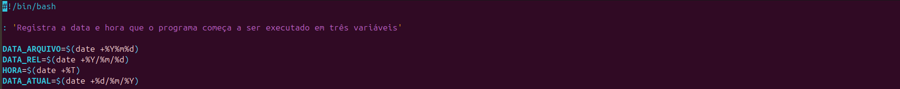

[**Voltar ao Sumário**](#sumário)

3. ... [Etapa 3 - Criação de diretórios e organização de arquivos](#Etapa3)

    Agora é criado o diretório ecommerce com o mkdir e o arquivo de dados_de_vendas.csv é movido para essa pasta, logo em seguida, as pastas vendas e backup são criados (obs: é utilizado a flag -p para evitar erro de criação de pasta já existente) e depois isso é movido o diretório de execução do script para que seja feito as execuções do comando para o backup do arquivo dados_de_vendas.csv que acabou de ser movido.

    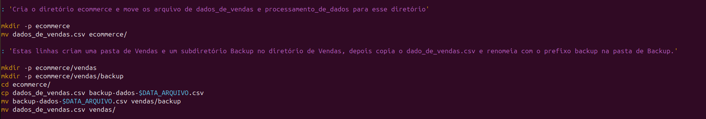

[**Voltar ao Sumário**](#sumário)

4. ... [Etapa 4 - Criação do relatorio$DATA_ARQUIVO](#Etapa4)

    Agora é criado o relatório$DATA_ARQUIVO.txt que irá receber os outputs do arquivo processado (dados_de_vendas.csv) pelo shell script. Primeiramente é feito o comando echo que irá registrar o dia e horário que fora registrado anteriormente e logo após isso é utilizado o comando awk para criar uma coluna auxiliar em um segundo arquivo para processar a ordenação do sort, para isso no comando awk o objetivo é imprimir todas as colunas já existentes e na sexta coluna é criado a coluna auxiliar que consiste na data no formato YYYYMMDD, pois utilizando o comando sort em uma data DD/MM/YYYY, a coluna é ordenado somente pelo dia, ou seja, se uma data 01/03/2024 é comparado com uma data 25/01/2024 com o comando sort na ordenação crescente numérica, a primeira data (01/03/2024) estará na frente da segunda data (24/01/2024). Portanto, no comando sort é utilizado a ordenação crescente numérica na sexta coluna (lembrando que foi utilizado as tags para respeitarem os separadores do arquivo csv).

    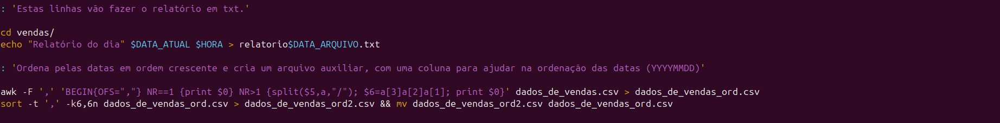

[**Voltar ao Sumário**](#sumário)

5. ... [Etapa 5 - Primeiro e último itens comprados relatorio$DATA_ARQUIVO](#Etapa5)

    Depois de processado a ordenação da tabela, se imprime a segunda linha (por causa do cabeçalho) que irá consistir na primeira data do registro de venda e o último registro de venda contendo a data do mesmo (novamente é utilizado o comando BEGIN para adicionar as vírgulas no output).

    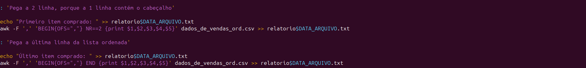

[**Voltar ao Sumário**](#sumário)

6. ... [Etapa 6 - Total de itens e os 10 primeiros itens relatorio$DATA_ARQUIVO](#Etapa6)

    Agora é contabilizado o número de itens diferentes e pegar as primeiras 10 linhas do arquivo csv, para isso foi utilizado o comando cut para filtrar os duplicadas na coluna 2 que corresponde ao nome do item, exemplo: camiseta e é utilizado o pipeline para que um comando seguinte ter a saída do outro, sendo assim, o primeiro é "selecionado" pela 2 coluna e em seguinda é tirado com o tail o cabeçalho da tabela e depois disso, é utilizado o sort para conseguir tirar itens duplicados com o comando uniq e finalmente é utilizado o wc para somar todos os itens restantes.

    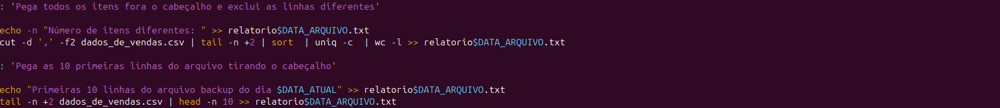

[**Voltar ao Sumário**](#sumário)

7. ... [Etapa 7 - Finalização do relatorio$DATA_ARQUIVO](#Etapa7)

    É deletado o arquivo auxiliar que foi utilizado para ordenação dos itens e o relatório movido para o diretório backup, logo após é movido o diretório de execução do script para compactar o arquivo backup-dados-$DATA_ARQUIVO.csv e em seguida é removido o arquivo csv, deixando apenas o arquivo compactado e para finalizar é deletado o arquivo dados_de_vendas.csv.
    
    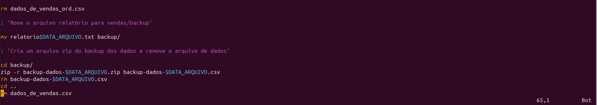

[**Voltar ao Sumário**](#sumário)

8. ... [Etapa 8 - crontab](#Etapa8)

    O crontab é um comando para agendar execuções no linux para isso é utilizado o crontab -e no terminal para editar o agendamento para executar o shell script.

    

[**Voltar ao Sumário**](#sumário)

9. ... [Etapa 9 - crontab configuração](#Etapa9)

    Para a sua configuração é colocado para o crontab executar o processamento_de_vendas.sh às 15h27 nos dias terça-feira a sábado, vale ressaltar que no comando é mudado o diretório de execução para a pasta raiz da Sprint1, porque se caso não se faça isso o shell script vai tentar executar no diretório home.

    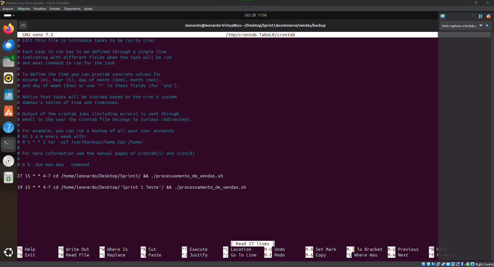

[**Voltar ao Sumário**](#sumário)

10. ... [Etapa 10 - Segundo script](#Etapa10)

    Após executado em quatro dias consecutivos o script, agora é gerado um relatório final com a junção dos quatro relatórios.

    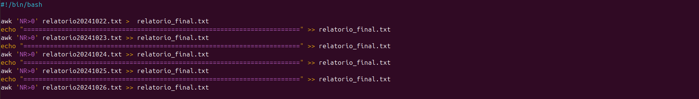

    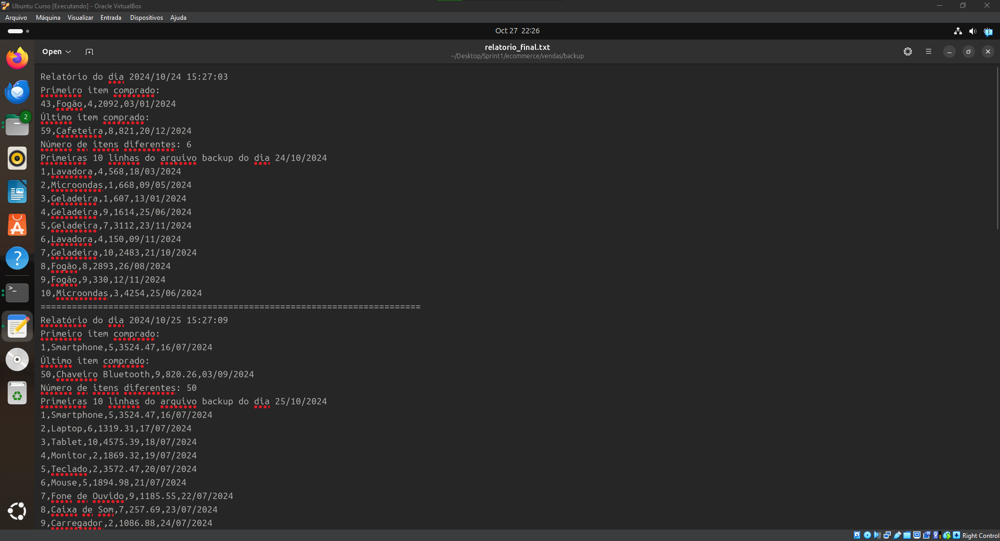

[**Voltar ao Sumário**](#sumário)

11. ... [Observações](#Observacoes)

    I. O relatório do dia 22/10/2024 teve um pequeno erro no começo da data que está no formato DD/MM/YYYY que não é o pedido pelo desafio, portanto, o problema foi arrumado no dia 24/10 e foi feito um novo relatório no dia 27/10 com a correção. O desafio pedia que o formato da data inicial fosse YYYY/MM/AA.

    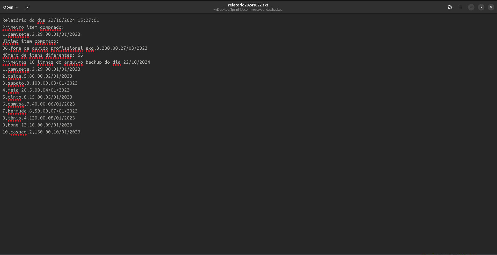

    II. Durante o dia 23/10/2024 tive um problema ao rodar script que fornecia um relatório com output errado, porém o problema foi resolvido por um conflito com arquivo CSV e não com o código do programa.

    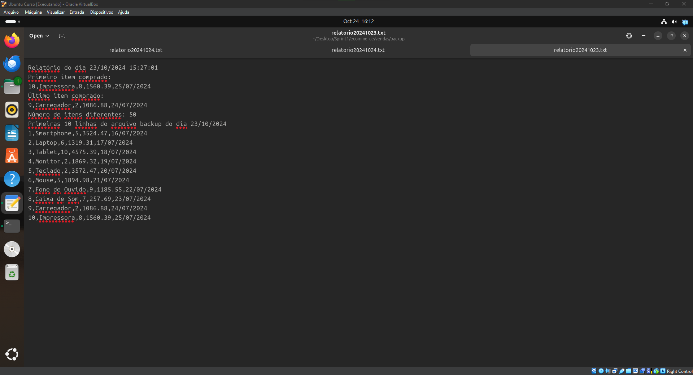

[**Voltar ao Sumário**](#sumário)

## Anexos

1. ... [Anexo 1 - Código](#Anexo1)

    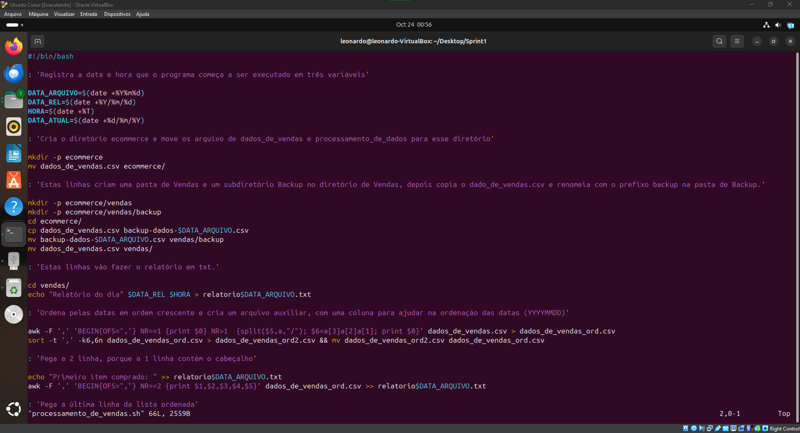

[**Voltar ao Sumário**](#sumário)

2. ... [Anexo 2 - Código](#Anexo2)

    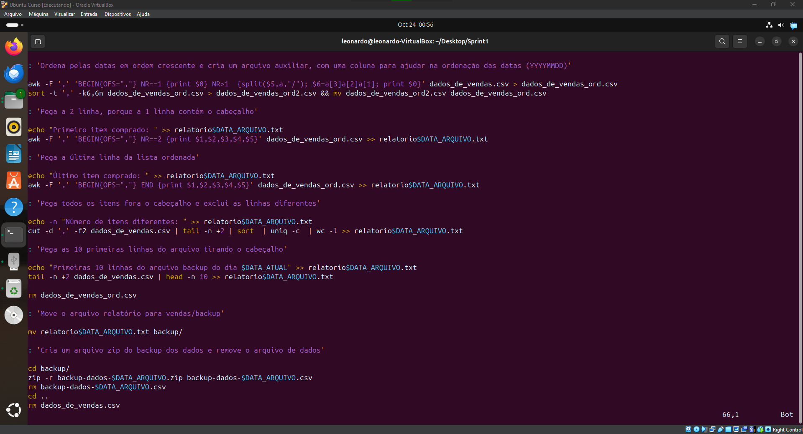

[**Voltar ao Sumário**](#sumário)

3. ... [Anexo 3 - Relatório feito no primeiro dia](#Anexo3)

    

[**Voltar ao Sumário**](#sumário)

4. ... [Anexo 4 - Comando history](#Anexo4)

    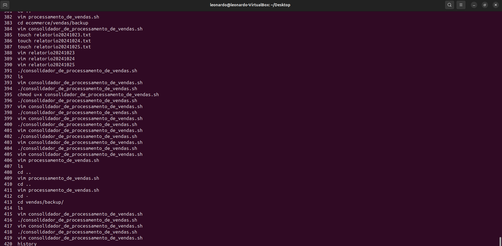

[**Voltar ao Sumário**](#sumário)

5. ... [Anexo 5 - Primeiros outputs testes](#Anexo5)

    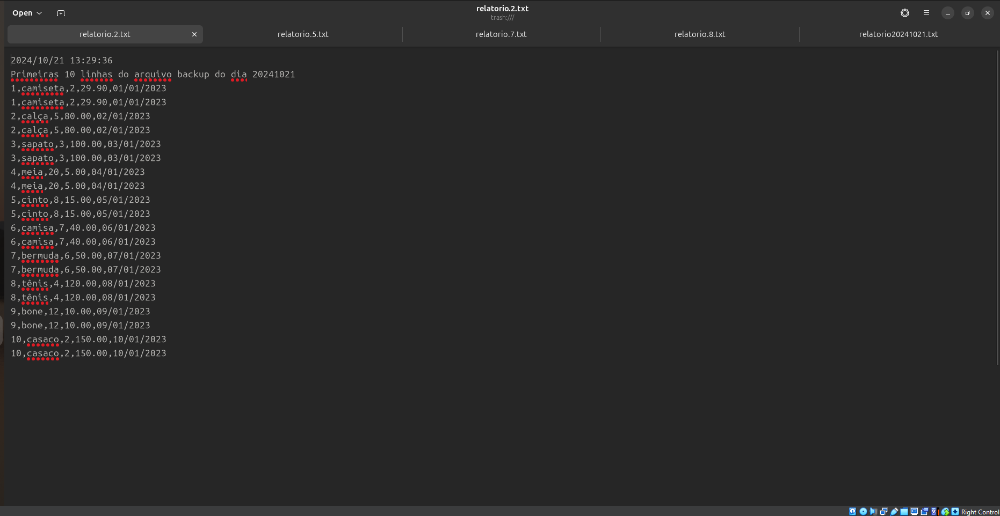

[**Voltar ao Sumário**](#sumário)

6. ... [Anexo 6 - Primeiros outputs testes 2](#Anexo6)

    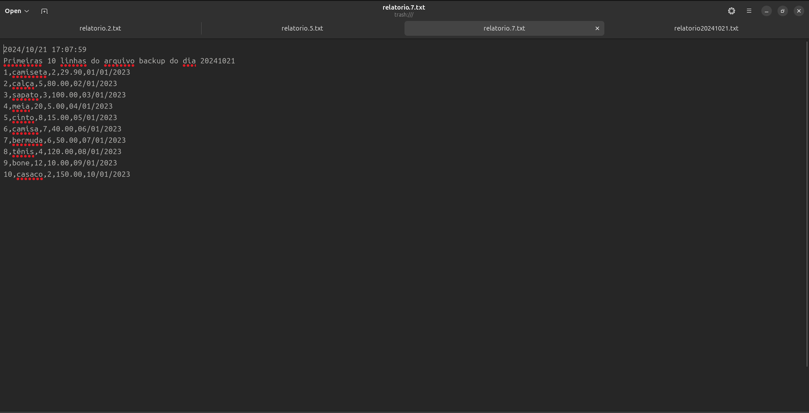

[**Voltar ao Sumário**](#sumário)

7. ... [Anexo 7 - Primeiros outputs testes 3](#Anexo7)

    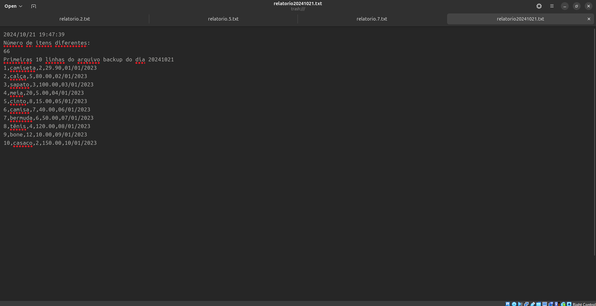

[**Voltar ao Sumário**](#sumário)

8. ... [Anexo 8 - Configurações da VM](#Anexo8)

    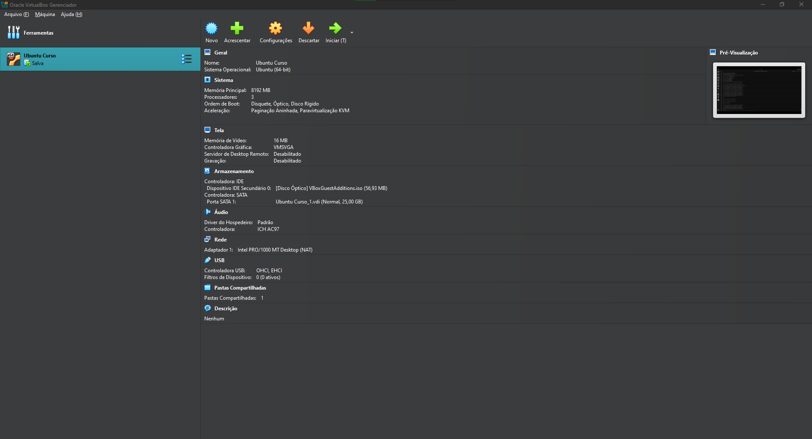

[**Voltar ao Sumário**](#sumário)

9. ... [Anexo 9 - Local do crontab](#Anexo9)

    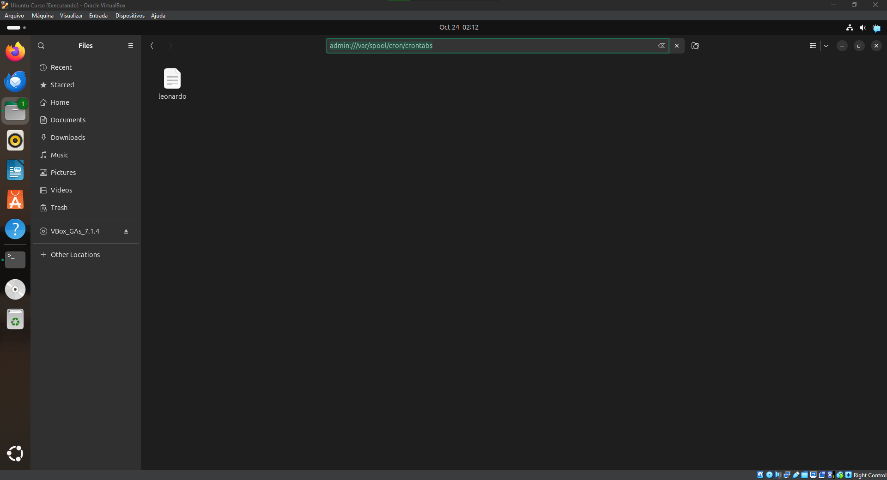

[**Voltar ao Sumário**](#sumário)

10. ... [Anexo 10 - Relatório gerado com CSV bugado do dia 23/10/2024](#Anexo10)

        

[**Voltar ao Sumário**](#sumário)