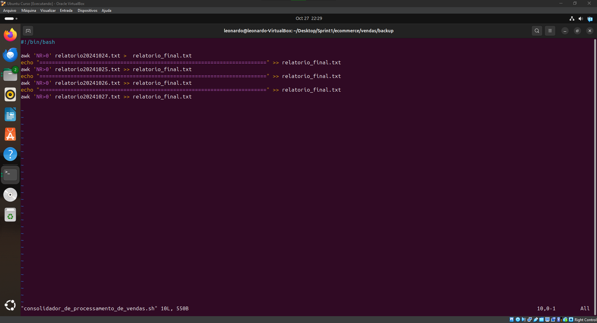

# Sumário

### Desafio:

1. [Etapas](#etapas)

2. [Anexos](#anexos)

### README:

1. [README Principal](../../README.md)

2. [README Sprint 1](../README.md)

# Etapas

Explicação do desenvolvimento dos shells scripts e anexos contendo algumas informações adicionais.

1. ... [Etapa 1 - Criação do arquivo processamento_de_vendas.sh](etapa-1)

    Inicialmente cria-se o arquivo processamento_de_vendas.sh e move para a pasta raiz do projeto (Script1).
    

2. ... [Etapa 2 - Interpretador, Datas e Horários](etapa-2)

    Após criado o arquivo, é escrito o interpretador do script no arquivo shell e é criado as variáveis para guardar as horas e as datas de execução do script.
    

3. ... [Etapa 3 - Criação de diretórios e organização de arquivos](etapa-3)

    Agora é criado o diretório ecommerce e o arquivo de dados_de_vendas.csv é movido para essa pasta, logo em seguida, as pastas vendas e backup são criados (obs: é utilizado a flag -p para evitar erro de criação de pasta já existente) e depois isso é movido o diretório de execução do script para que seja feito as execuções do comando para o backup do arquivo dados_de_vendas.csv que acabou de ser movido.
    

4. ... [Etapa 4 - Criação do relatoriodata.txt](etapa-4)

    Agora é criado o relatório$DATA_ARQUIVO.txt que irá receber os outputs do arquivo processado dados_de_vendas. Primeiramente é feito o comando echo que irá registrar o dia e horário que fora registrado anteriormente e logo após isso é utilizado o comando awk para criar uma coluna auxiliar em um segundo arquivo para processar a ordenação do sort para isso no comando awk é imprimir todas as colunas já existentes e na sexta coluna é criado a coluna auxiliar que consiste na data no formato YYYYMMDD, pois utilizando o comando sort em uma data DD/MM/YYYY é ordenado somente pelo dia, ou seja, se uma data 01/03/2024 é comparado com uma data 25/01/2024 com o comando sort a primeira data estará na frente da segunda data. Portanto, no comando sort é utilizado a ordenação numérica na sexta coluna (lembrando que foi utilizado as tags para respeitarem os separadores do arquivo csv). Obs.: Durante o dia 23/10/2024 tive um problema ao rodar script que fornecia um relatório com output errado, porém o problema foi resolvido por um conflito com arquivo CSV e não com o código do programa. Vide [Anexo 10](<../Evidencias/ANEXO10_-_RELATORIO_GERADO_COM_CSV_BUGADO.png>).
    

5. ... [Etapa 5 - Primeiro e último item comprados relatoriodata.txt](etapa-5)

    Depois de processado a ordenação, se imprime a segunda linha (por causa do cabeçalho) que irá consistir na primeira data do registro de venda e o último registro de venda contendo a data do mesmo (novamente é utilizado o comando BEGIN para adicionar as virgulas no output).
    

6. ... [Etapa 6 - Total de itens e os 10 primeiros itens relatoriodata.txt](etapa-6)

    Agora é contabilizado o número de itens diferentes e pegar as primeiras 10 linhas do arquivo csv, para isso foi utilizado o comando cut para filtrar as duplicadas na coluna 2 que corresponde ao nome do item, exemplo: camiseta e é utilizado o pipeline para um comando seguinte ter a saída do outro, sendo assim, primeiro é "selecionado" pela 2 coluna e em seguinda é tirado com o tail o cabeçalho da tabela e em seguida é utilizado o sort para conseguir tirar duplicatas com o comando uniq e finalmente é utilizado o wc para somar todos os itens restantes.
    

7. ... [Etapa 7 - Finalização do relatoriodata.txt](etapa-7)

    É deletado o arquivo auxiliar que foi utilizado para ordenação dos itens e o relatório é movido para o diretório backup e logo após é movido o diretório de execução do script para compactar o arquivo backup-dados-$DATA_ARQUIVO.csv e é removido o arquivo csv, deixando só o arquivo compactado e logo após é deletado o arquivo dados_de_vendas.csv.
    

8. ... [Etapa 8 - crontab](etapa-8)

    O crontab é um comando para agendar execuções no linux para isso é utilizado o crontab -e no terminal para editar o agendamento para executar o shell script.
    

9. ... [Etapa 9 - crontab configuração](etapa-9)

    Para a sua configuração é colocado para o crontab executar o processamento_de_vendas.sh às 15h27 nos dias terça-feira a sábado, vale ressaltar que no comando é mudado o diretório de execução para a pasta raiz da Sprint1, porque se caso não se faça isso o shell script vai tentar executar no diretório home.
    

10. ... [Etapa 10 - Segundo script](etapa-10)

    Após executado em quatro dias consecutivos o script, agora é gerado um relatório final com a junção dos quatro relatórios.
    

[**Voltar Sumário**](#sumário)

## Anexos

1. ... [Anexo 1 - Código](anexo-1)

    

2. ... [Anexo 2 - Código](anexo-2)

    

3. ... [Anexo 3 - Relatório feito no primeiro dia](anexo-3)

    

4. ... [Anexo 4 - Comando history](anexo-4)

    

5. ... [Anexo 5 - Primeiros outputs testes](anexo-5)

    

6. ... [Anexo 6 - Primeiros outputs testes 2](anexo-6)

    

7. ... [Anexo 7 - Primeiros outputs testes 3](anexo-7)

    

8. ... [Anexo 8 - Configurações da VM](anexo-8)

    

9. ... [Anexo 9 - Local do crontab](anexo-9)

    

10. ... [Anexo 10 - Relatório gerado com CSV bugado do dia 23/10/2024](anexo-10)

        

[**Voltar Sumário**](#sumário)