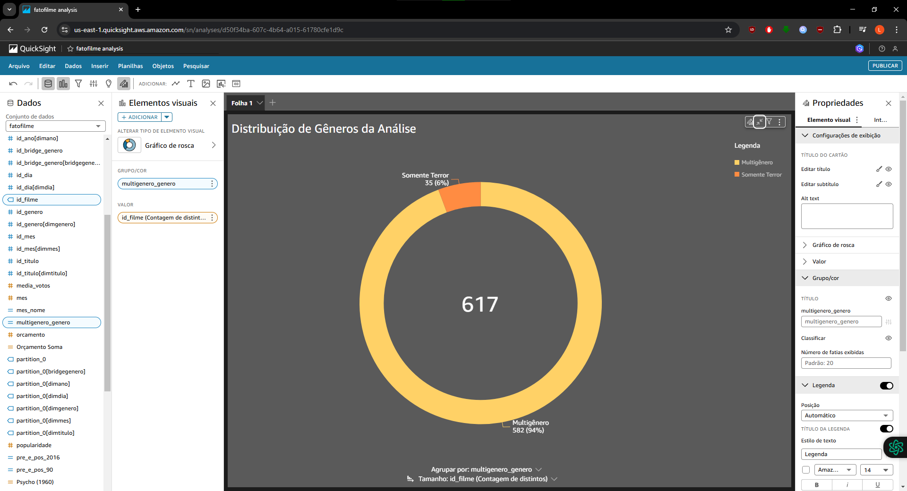
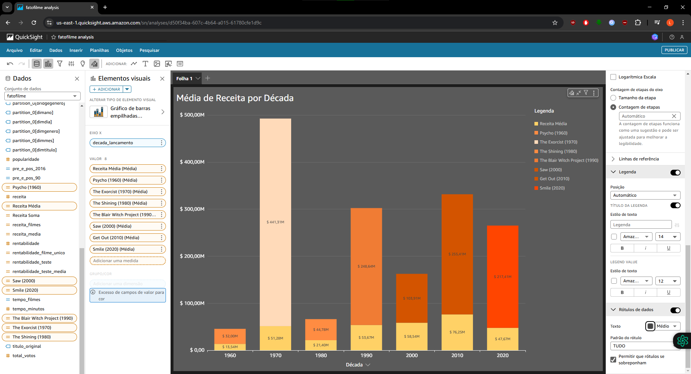
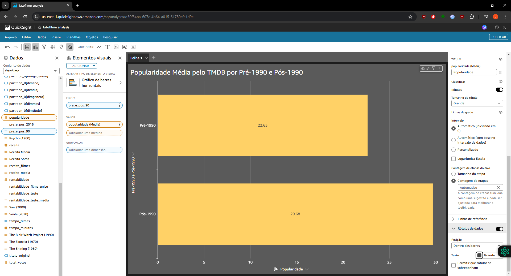

# Sumário

### Desafio:

1.  [Dashboard QuickSight](quicksight/dashboard/dashboard_analise_terror.pdf)

2.  [Script de Python para o Glue](scripts/GLUE/script_refined_glue_spark_atualizado.py)

3.  [Script de Python Local](scripts/LOCAL/script_refined_local_spark_atualizado.py)

4.  [Script SQL para o diagrama ER](sql/sql_er_atualizado.sql)

5.  [Script SQL que fez a verificação local dos arquivos gerados pelo Glue](sql/sql_verificacao_atualizado.sql)

6.  [Diagrama ER](../Evidencias/Desafio/ETAPA1_1_-_RELACOES_ER.png)

7.  [Arquivo Parquet da tabela fato_filme](parquet/GLUE/fato_filme/part-00000-0ed1213d-2a55-4c00-880e-81e6f7d1f2fd-c000.snappy.parquet)

8.  [Arquivo Parquet da tabela dim_titulo 1](parquet/GLUE/dim_titulo/part-00000-68428cb5-53b7-43c0-8db9-9ef92eee27c7-c000.snappy.parquet)

    [Arquivo Parquet da tabela dim_titulo 2](parquet/GLUE/dim_titulo/part-00001-68428cb5-53b7-43c0-8db9-9ef92eee27c7-c000.snappy.parquet)

    [Arquivo Parquet da tabela dim_titulo 3](parquet/GLUE/dim_titulo/part-00002-68428cb5-53b7-43c0-8db9-9ef92eee27c7-c000.snappy.parquet)

    [Arquivo Parquet da tabela dim_titulo 4](parquet/GLUE/dim_titulo/part-00003-68428cb5-53b7-43c0-8db9-9ef92eee27c7-c000.snappy.parquet)

9.  [Arquivo Parquet da tabela dim_dia](parquet/GLUE/dim_dia/part-00000-1864e59d-894f-4970-839a-226dc4779141-c000.snappy.parquet)

10. [Arquivo Parquet da tabela dim_mes](parquet/GLUE/dim_mes.parquet\part-00000-d5d2f4b8-8d0b-455a-a339-9a2de9f33b01-c000.snappy.parquet)

11. [Arquivo Parquet da tabela dim_ano](parquet/GLUE/dim_ano/part-00000-599e36e4-4485-4c0d-a86f-cb2356a6bd4c-c000.snappy.parquet)

12. [Arquivo Parquet da tabela dim_genero](parquet/GLUE/dim_genero/part-00000-883c5bba-87f6-48c7-b4d5-e49a86c8cb90-c000.snappy.parquet)

13. [Arquivo Parquet da tabela bridge_genero 1](parquet/GLUE/bridge_genero/part-00000-5bbd41dc-0ee3-4ce9-9fde-bb45a51ce5e2-c000.snappy.parquet)

    [Arquivo Parquet da tabela bridge_genero 2](parquet/GLUE/bridge_genero/part-00001-5bbd41dc-0ee3-4ce9-9fde-bb45a51ce5e2-c000.snappy.parquet)

    [Arquivo Parquet da tabela bridge_genero 3](parquet/GLUE/bridge_genero/part-00002-5bbd41dc-0ee3-4ce9-9fde-bb45a51ce5e2-c000.snappy.parquet)

    [Arquivo Parquet da tabela bridge_genero 4](parquet/GLUE/bridge_genero/part-00003-5bbd41dc-0ee3-4ce9-9fde-bb45a51ce5e2-c000.snappy.parquet)

1. [Etapas](#etapas)

    I.    [Etapa 1 - Correção da camada Refined](#Etapa1)

    II.   [Etapa 2 - Amazon QuickSight](#Etapa2)

    III.  [Etapa 3 - Conclusão do desafio final](#Etapa3)
    
    IV.   [Observações](#Observacoes)

2. [Anexos](#anexos)

    I.    [Anexo 1 - Versão VSCode](#Anexo1)

    II.   [Anexo 2 - Versão Pyspark](#Anexo2)

    III.  [Anexo 3 - Versão Java](#Anexo3)

    IV.   [Anexo 4 - Versão Dbeaver](#Anexo4)

### README:

1. [README Principal](../../README.md)

2. [README Sprint 10](../README.md)

# Etapas

Explicação do desenvolvimento da etapa final do desafio que é a criação do dashboard no QuickSight. Para o desenvolvimento foi utilizado o VSCode Version 1.97.2 (Release Date 12/02/2025), [winutils - hadoop 3.0 (GitHub de onde o arquivo foi baixado)](https://github.com/steveloughran/winutils/tree/master),Pyspark version 3.5.4, Java version "11.0.25" 2024-10-15 e DBeaver Version 24.3.4.202502021521 Release Date 03/02/2025, para mais informações: [Anexo 1 - Versão VSCode](#Anexo1), [Anexo 2 - Versão Pyspark](#Anexo2), [Anexo 3 - Versão Java](#Anexo3), [Anexo 4 - Versão Dbeaver](#Anexo4).

1. ... [Etapa 1 - Correção da camada Refined](#Etapa1)

    Houve uma correção da camada Refined referente as tabelas dimensões e fato, em que a tabela fato não continha a coluna data_lancamento nela e com isso a tabela dim_tempo foi reformulada para ser 3 tabelas dimensões separadas que uma vai conter o dia, a outra mes e a última o ano. Assim o diagrama ER com as novas modificações ficaram assim:

    

    As perguntas da Sprint 6 foram reformuladas para as seguintes perguntas (como mencionado nas [(na análise final vai ser utilizado apenas dados que respeitam os filtros que foram utilizados no endpoint discover que são: no mínimo 300 votos, com a votação média de 5, do gênero Terror e de idioma falado no filme inglês (Sprint 07).)](#Observacoes)):

    **Do Cinema ao Streaming: Como as Bilheterias e Tendências do Terror Foram Moldadas pelas Décadas e Evoluídas pela Tecnologia**

    1) As bilheterias totais dos filmes mais populares do gênero terror de cada década. Elas têm aumentado a cada década? Qual foi a melhor década para os filmes populares de terror em termos de rentabilidade para o gênero terror?

    2) Comparar os filmes listados (que são uns dos mais populares), a seguir que começam da década de 60 até os dias atuais om os filmes do mesmo gênero em sua respectiva década.

    - Psycho (Psicose) - 1960-1970;
    - The Exorcist (O Exorcista) - 1970-1980;
    - The Shining (O Iluminado) - 1980-1990;
    - The Blair Witch Project (A Bruxa de Blair) - 1990-2000;
    - Saw (Jogos Mortais) - 2000-2010;
    - Get Out (Corra) - 2010-2020;
    - Smile (Sorria) - 2020-2024.

        Esses filmes tiveram uma receita em relação a média dos outros filmes dessa década?

    3) Os filmes lançados no mês de Halloween tiveram uma maior bilheteria em relação aos outros filmes?

    4) Há alguma relação entre a duração do filme e rentabilidade?

    5) Os filmes pré-década de 90 (surgimento da internet teve impacto?) ainda são populares nos dias de hoje?    

    6) O impacto da popularização do streaming afetou a bilheteria? Considere que streamings como Netflix começaram a ficar popular em 2016, ou seja, comparar os dados de bilheterias de antes dessa data com as de depois dessa data.
    
[**Voltar ao Sumário**](#sumário)

2. ... [Etapa 2 - Amazon QuickSight](#Etapa2)

    Depois de selecionar o QuickSight no console e criar a conta no mesmo. Agora é criado uma análise no QuickSight e selecionado os dados(e tabelas) é criado as relações entre as tabelas que tem que respeitar o que foi feito no diagrama mostrado anterior, assim as relações entre as tabelas no QuickSight ficaram assim:

    

    E agora pode-ser verificar como ficará as linhas dessa tabela no QuickSight.

    

    

    

    Após ter realizado as relações das tabelas são criados 4 KPIs que vão conter respectivamente: número de filmes em análise(contagem de distintos), receita total(campo calculado), orçamento total(campo calculado) e rentabilidade média(média da coluna rentabilidade).
    
    

    

    No campo calculado da receita total do KPI é somado a receita, porém é pego o valor mínimo desse mesmo ID, isso deve ser feito, porque os filmes podem ter mais de um gênero, assim, é colocado apenas um valor da receita e o campo calculado no QuickSight ficou nesse modo: 

    

    

    No campo calculado do orçamento total é realizado o mesmo procedimento da receita total, só que agora é para a coluna orcamento.

    

    

    Na distribuição dos gêneros dos filmes analisados é utilizado o gráfico de rosca que vai ser separado em duas categorias: "Multigênero" e "Somente Terror".

    

    No campo calculado da distribuição de gêneros na qual é verificado se pelo id_bridge_genero que está ligado ao filme tem mais de uma ocorrência e se essa ocorrência é também do gênero de terror para isso é utilizado a função ifelse que verifica se isso é verdadeiro e o countOver que conta essas ocorrências. Se tiver mais de uma ocorrência é especificado como "Multigênero" e se não "Somente Terror".

    

    No gráfico seguinte é criado um gráfico de barras empilhadas que serão colocas os valores de receita média a cada década, que irão ser comparadas a cada filme popular em sua respectiva década que são Psycho (1960), The Exorcist(1970), The Shining(1980), The Blair Witch Project(1990), Saw(2000), Get Out(2010), Smile(2020).

    

    No campo calculado de decada_lancamento é utilizado a função floor, só que irá ser dividido primeiro o ano por 10 que pode dar um número decimal que com a ajuda da função floor se caso dê um valor decimal, o número irá ser arredondado para baixo na qual irá corresponder na sua respectiva década.
    
    

    Na Receita Média é pego somente o valor da receita para que na legenda o valor esteja na formatação correspondente aos demais.

    

    Para os próximos valores calculados vão ser utilizados o ifelse para encontrar o filme correspondente e colocado o valor da receita do filme.

    

    

    

    

    

    

    

    Agora é feito um gráfico de linhas que vai conter os valores de receita(laranja) e orçamento(amarelo) distribuídos ao decorrer das décadas. Para o eixo X foi utilizado o campo calculado da década que fora utilizado anteriormente e para o eixo Y foram utilizados os campos calculados receita soma e orçamento soma que também foram utilizados anteriormente.

    

    Neste próximo gráfico que é de barras, também é feito a utilização dos campos calculados de soma de receita(laranja) e soma de orçamento(receita), só que agora é feito a separação por meses(eixo X).

    

    No campo calculado é somente "transformado" a coluna que contém os meses para que não se mostre no gráfico os números de 1 a 12. Assim, utilizando a função ifelse é colocado que o mês 1 é Janeiro, mês 2 é Fevereiro, mês 3 é Março e assim sucessivamente. 

    

    No gráfico seguinte é utilizado o valor da rentabilidade média no eixo Y e no eixo X é distribuído os dados em tempo de duração dos filmes que são: Até 80 minutos, 81 a 100 minutos, 101 a 120 minutos e mais que 120 minutos.

    

    Foi feito uma nova coluna que contém o valor da rentabilidade do filme, na qual consiste em (receita - orçamento) / orçamento.

    

    Agora em relação a duração dos filmes é separado em categorias como mencionado anteriormente, porém é utilizado a coluna tempo_minutos para criar essas novas categorias.

    

    Neste gráfico é feito um mapa de árvore em que é feito a relação das décadas com a rentabilidade em cada uma delas.

    

    Agora neste gráfico é feito um gráfico de barras horizontais é verificado a popularidade média dos filmes (segundo TMDB) em relação dos anos pré-90 e pós-90 para verificar o impacto da popularidade média dessas duas épocas.

    

    No campo calculado é criado a função ifelse que irá separar essas duas épocas respeitando a condição ano < 1990.

    

    No próximo gráfico é criado um gráfico de barras só que agora o eixo X é os anos antes de 2016 e depois de 2016 que irá comparar os dados em uma era pré-streaming e pós-streaming em relação a rentabilidade dos filmes.

    

    No campo calculado é criado novamente um ifelse que irá respeitar a condição de ano <=2016.

    

[**Voltar ao Sumário**](#sumário)

3. ... [Etapa 3 - Conclusão do desafio final](#Etapa3)

    Recapitulando todo o processo do desafio final:

    Na Sprint 6 primeiro foi fornecido arquivos CSVs que continham informações de filmes e séries que continham dados como atores, gêneros, popularidade entre outros dados. Com esses arquivos foi feito um Datalake em um bucket da S3 que dentro dele vai ter 3 camadas RAW, Trusted e Refined. Nessa Sprint foi feito a camada RAW que é a camada que contém os dados brutos do desafio onde esses arquivos CSVs serão alocados e para isso foi utilizado a biblioteca boto3 em uma IDE local que com a ajuda dessa biblioteca foi feito todo esse procedimento de criação do bucket até o upload desses arquivos.

    Na Sprint 7 foi feito a extração de dados pelo site do TMDB que têm uma API na qual será responsável da extração de todos os dados necessários para complementarem as informações dos arquivos CSVs. Para todo esse processo foi utilizado o AWS Lambda e os arquivos gerados estavam no formato JSON e deveriam ser feito o upload na camada RAW do Datalake.

    Na Sprint 8 foi feito o tratamento de dados dos arquivos CSV e JSON das sprints anteriores e nesse tratamento foi retirado valores duplicados, nulos e foi colocado o tipo da coluna com seu correspondente formato. Todo esse procedimento foi feito no AWS Glue e os arquivos finais deveriam estar no formato parquet e colocados na camada Trusted do Datalake.

    Na Sprint 9 as tabelas do arquivo parquet da camada Trusted deveriam ser transformados no Modelo Dimensional sendo criado a tabela fato e dimensão e as colunas das tabelas deveriam ser apenas dados relevantes a análise final. O AWS Glue foi o serviço da AWS utilizado para todo esse procedimento e no final os arquivos foram colocados na camada Refined.

    Na Sprint 10 é a última etapa do desafio final e nele foi criado um dashboard pelo AWS QuickSight e o dashboard final deve estar no formato PDF.

    **Do Cinema ao Streaming: Como as Bilheterias e Tendências do Terror Foram Moldadas pelas Décadas e Evoluídas pela Tecnologia**

    1) As bilheterias totais dos filmes mais populares do gênero terror de cada década. Elas têm aumentado a cada década? Qual foi a melhor década para os filmes populares de terror em termos de rentabilidade para o gênero terror?

        Para essa pergunta o gráfico feito foi o de linha em que houve um aumento ao decorrer das décadas, porém na última década (2020) pode-se ver que houve uma diminuição. Pode ter várias explicações para isso, mas talvez uma das maiores seja que foi na década que ocorreu a pandemia da COVID-19 junto com o crescimento dos serviços de streaming. E a década que houve o maior aumento de relação orçamento/receita foi a década de 2010.

        

    2) Comparar os filmes listados (que são uns dos mais populares), a seguir que começam da década de 60 até os dias atuais om os filmes do mesmo gênero em sua respectiva década.

    - Psycho (Psicose) - 1960-1970;
    - The Exorcist (O Exorcista) - 1970-1980;
    - The Shining (O Iluminado) - 1980-1990;
    - The Blair Witch Project (A Bruxa de Blair) - 1990-2000;
    - Saw (Jogos Mortais) - 2000-2010;
    - Get Out (Corra) - 2010-2020;
    - Smile (Sorria) - 2020-2024.

        Esses filmes tiveram uma receita em relação a média dos outros filmes dessa década?

            Nessa pergunta foi utilizado o gráfico de barras empilhadas e nele a gente consegue observar que em todas as décadas esses filmes tiveram uma receita maior que a média da década para efeito de comparação esses foram os resultados:

            - Psycho (Psicose) 32 milhões de dólares - 13,54 milhões dólares média da decada de 1960-1970;
            - The Exorcist (O Exorcista) 441,31 milhões de dólares - 51,28 milhões de dólares média da decada de 1970-1980;
            - The Shining (O Iluminado) 44,78 milhões de dólares - 21,4 milhões de dólares média da decada de 1980-1990;
            - The Blair Witch Project (A Bruxa de Blair) 248,64 milhões de dólares - 53,67 milhões de dólares média da decada de 1990-2000;
            - Saw (Jogos Mortais) 103,91 milhões de dólares - 58,54 milhões de dólares média da decada de 2000-2010;
            - Get Out (Corra) 255,41 milhões de dólares - 76,25 milhões de dólares média da decada de 2010-2020;
            - Smile (Sorria) 217,41 milhões de dólares - 47,67 milhões de dólares média da decada de 2020-2024.

        

    3) Os filmes lançados no mês de Halloween tiveram uma maior bilheteria em relação aos outros filmes?

        Para essa pergunta podemos ver que no mês de Outubro realmente tem uma receita maior que as outras, entretanto, em Novembro há um baixo valor de receita. E foi utilizado um gráfico de barras verticais.

        

    4) Há alguma relação entre a duração do filme e rentabilidade?

        Nesse gráfico (barras verticais) é verificado que os filmes de curta duração tendem a ter uma rentabilidade maior.

        

    5) Os filmes pré-década de 90 (surgimento da internet teve impacto?) ainda são populares nos dias de hoje?

        Podemos ver que no gráfico das barras horizontais a popularidade média antes da década 1990 é levemento menor que a pós década de 1990.

        

    6) O impacto da popularização do streaming afetou a bilheteria? Considere que streamings como Netflix começaram a ficar popular em 2016, ou seja, comparar os dados de bilheterias de antes dessa data com as de depois dessa data.

        Pelo gráfico de barras conseguimos ver que a rentabilidade teve um melhor desempenho nos anos anteriores a 2016, um valor quase 3x mais que depois de 2016.

        

    Durante a análise e a formulação das perguntas, foram considerados eventos que poderiam influenciar a bilheteria dos filmes, como o Halloween, devido ao fato de serem analisados filmes de terror, o impacto da popularização do streaming e o desempenho da popularidade dos filmes antigos antes da era da internet e das redes sociais.

    Assim, foi possível perceber que muitos desses eventos foram relevantes e afetaram, de alguma forma, a receita de cada filme. Por exemplo, antes da era do streaming, os filmes dependiam majoritariamente do lançamento nos cinemas para gerar receita. Com a popularização das plataformas de streaming, esse cenário mudou significativamente, impactando os números de bilheteria. No entanto, é importante considerar que as assinaturas dessas plataformas não são contabilizadas na receita analisada, o que pode influenciar a interpretação dos dados.

[**Voltar ao Sumário**](#sumário)

3. ... [Observações](#Observacoes)

    I. As perguntas sofreram reformulações para um melhor direcionamento da análise.

    II. Para a utilização do Pyspark localmente foi instalado Java 11, o winutils - hadoop 3.0, pyspark 5.4.3 via pip install como mostrado no começo das etapas.

    III. Como dito durante as etapas, o script foi primeiro "debuggado" localmente, depois testado e adaptado para o ambiente do Glue.

    IV. Para a análise final vai ser utilizado apenas dados que respeitam os filtros que foram utilizados no endpoint discover que são: no mínimo 300 votos, com a votação média de 5, do gênero Terror, de idioma falado no filme inglês (Sprint 07) e também foi utilizado filmes somente com a [década acima de 1960](#Anexo5).

    V. Foi necessário manter a tabela bridge_genero para que não houvesse linhas duplicadas na tabela fato filme.

[**Voltar ao Sumário**](#sumário)

## Anexos

1. ... [Anexo 1 - Versão VSCode](#Anexo1)

    

[**Voltar para Etapas**](#Etapas)

[**Voltar ao Sumário**](#sumário)

2. ... [Anexo 2 - Anexo 2 - Versão Pyspark](#Anexo2)

    

[**Voltar para Etapas**](#Etapas)

[**Voltar ao Sumário**](#sumário)

3. ... [Anexo 3 - Versão Java](#Anexo3)

    

[**Voltar para Etapas**](#Etapas)

[**Voltar ao Sumário**](#sumário)

4. ... [Anexo 4 - Versão DBeaver](#Anexo4)

    

[**Voltar para Etapas**](#Etapas)

[**Voltar ao Sumário**](#sumário)

5. ... [Anexo 5 - Filtro utilizado em todos os gráficos](#Anexo5)

    

[**Voltar para Etapas**](#Etapas)

[**Voltar ao Sumário**](#sumário)

