# Sumário

### Desafio:

1. [processamento_de_vendas.sh](Sprint1\processamento_de_vendas.sh)

2. [consolidador_de_vendas.sh](Sprint1\ecommerce\vendas\backup\consolidador_de_processamento_de_vendas.sh)

3. *[relatorio20241022.txt](Sprint1\ecommerce\vendas\backup\relatorio20241022.txt)

4. *[relatorio20241023.txt](Sprint1\ecommerce\vendas\backup\relatorio20241023.txt)

5. [relatorio20241024.txt](Sprint1\ecommerce\vendas\backup\relatorio20241024.txt)

6. [relatorio20241025.txt](Sprint1\ecommerce\vendas\backup\relatorio20241025.txt)

7. [relatorio20241026.txt](Sprint1\ecommerce\vendas\backup\relatorio20241026.txt)

8. [relatorio20241027.txt](Sprint1\ecommerce\vendas\backup\relatorio20241027.txt)

9. [relatorio_final.txt](Sprint1\ecommerce\vendas\backup\relatorio_final.txt)

10. [dados_de_vendas.csv](Sprint1\dados_de_vendas\dados_de_vendas.csv)

11. [dados_de_vendas2.csv](Sprint1\dados_de_vendas\dados_de_vendas2.csv)

12. [dados_de_vendas3.csv](Sprint1\dados_de_vendas\dados_de_vendas3.csv)

13. [dados_de_vendas4.csv](Sprint1\dados_de_vendas\dados_de_vendas4.csv)

*[Observações](#Observacoes)

1. [Etapas](#etapas)

    I.    [Etapa 1 - Verificação dos dados da tabela](#Etapa1)

    II.   [Etapa 2 - Tratamento de dados](#Etapa2)

    III.  [Etapa 3 - Criação de uma tabela auxiliar e o primeiro tratamento de dados](#Etapa3)

    IV.   [Etapa 4 - Finalização do tratamento de dados](#Etapa4)

    V.    [Etapa 5 - Criação das tabelas e normalização](#Etapa5)

    VI.   [Etapa 6 - Inserção dos dados nas novas tabelas](#Etapa6)

    VII.  [Etapa 7 - Modelo Relacional para Dimensional](#Etapa7)

    VIII. [Etapa 8 - Inserção dos dados no Modelo Dimensional](#Etapa8)

    IX.   [Observações](#Observacoes)

2. [Anexos](#anexos)

    I.    [Anexo 1 - Tabela tb_locacao_atual](#Anexo1)

    II.   [Anexo 2 - Tabela tb_carro](#Anexo2)

    III.  [Anexo 3 - Tabela tb_cliente](#Anexo3)

    IV.   [Anexo 4 - Tabela tb_vendedor](#Anexo4)

    V.    [Anexo 5 - Tabela tb_combustivel](#Anexo5)

    VI.   [Anexo 6 - Diagrama Entidade Relacionamento Modelo Relacional](#Anexo6)

    VII.  [Anexo 7 - Tabela fato_locacao](#Anexo7)

    VIII. [Anexo 8 - Tabela dim_carro](#Anexo8)

    IX.   [Anexo 9 - Tabela dim_cliente](#Anexo9)

    X.    [Anexo 10 - Tabela dim_vendedor](#Anexo10)

    XI.   [Anexo 11 - Diagrama Entidade Relacionamento Modelo Dimensional](#Anexo11)

    XII.  [Anexo 12 - Versão do DBeaver](#Anexo12) 

    XIII. [Anexo 13 - Versão do SQLite](#Anexo13)      

### README:

1. [README Principal](../../README.md)

2. [README Sprint 2](../README.md)

# Etapas

Explicação do desenvolvimento da normalização da tabela e criação do Modelo Relacional e Dimensional. Para o desenvolvimento foi utilizado o DBeaver Version 24.2.4.202411031831 (Release Date 04/11/2024) e SQLITE version 3.47.0. (Release Date 21/10/2024) para mais informações: [Anexo 12 - Versão do DBeaver](#Anexo12) e [Anexo 13 - Versão do SQLite](#Anexo13) 

1. ... [Etapa 1 - Verificação dos dados da tabela](#Etapa1)

    Inicialmente verifica-se os dados que contém na tabela (tb_locacao) e percebe-se alguns dados que devem ser tratados antes de começar o processo de normalização (a imagem representa apenas uma parte dela, os dados que serão tratados vão ser mostrados na etapa seguinte).
    
    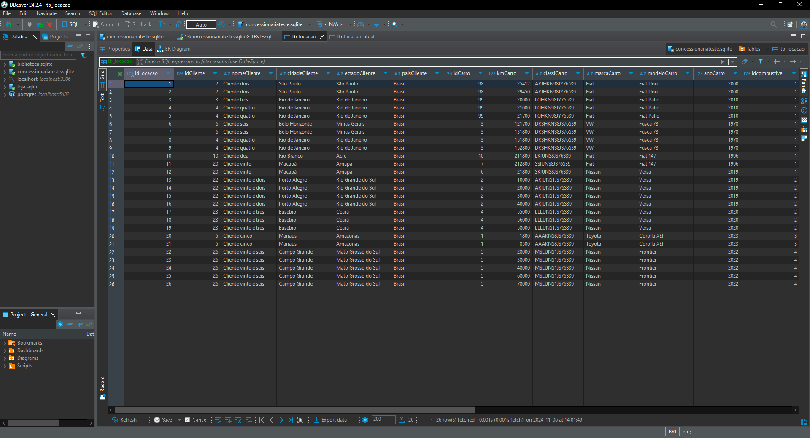

[**Voltar ao Sumário**](#sumário)

2. ... [Etapa 2 - Tratamento de dados](#Etapa2)

    As colunas dataLocacao e dataEntrega aparecem em um formato não desejado (YYYYMMDD) para datas e diferente dos exercícios feitos no SQL que estão no formato YYYY-MM-DD e a coluna de horaLocacao alguns horários estão no formato H:MM e não no formato HH:MM, finalmente a coluna sexoVendedor está em um "formato binário", para uma melhor visualização dos dados será trocado por M que corresponde ao sexo masculino e F para o sexo feminino.

    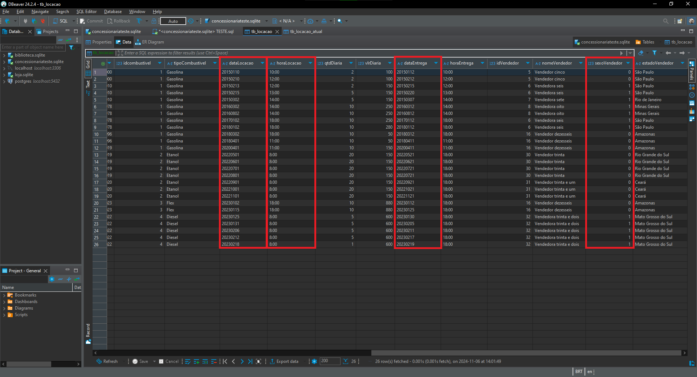

[**Voltar ao Sumário**](#sumário)

3. ... [Etapa 3 - Criação de uma tabela auxiliar e o primeiro tratamento de dados](#Etapa3)

    Primeiro é importante ressaltar que no SQLITE é difícil de utilizar o comando ALTER TABLE para alterar a tabela, por isso foi decidido que é necessário criar tabelas novas. Para isso foi criado uma tabela auxiliar e cópia a original para que caso haja perda de dados ou alterações errôneas esses dados da tabela sejam mantidos, pois irá se utilizar o comando UPDATE que irá alterar os valores da tabela original e logo após isso executamos o comando UPDATE com o auxílio da função printf que coloca o "formato" de saída desejado que é YYYY-MM-DD e juntamente com a função SUBSTR que retorna uma string a partir da posição dada e o tamanho dela.

    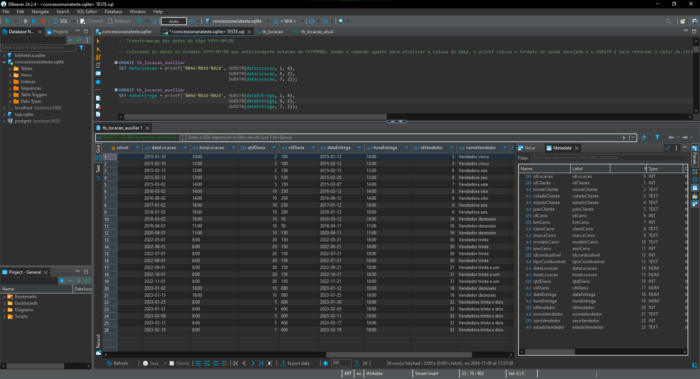

[**Voltar ao Sumário**](#sumário)

4. ... [Etapa 4 - Finalização do tratamento de dados](#Etapa4)

    Agora é feito o tratamento de dados referente às horas que começa com o comando UPDATE e também se utiliza a função printf que foi dito anteriormente, só que agora o formato será HH:MM e logo se utiliza a função CAST para que os números sejam retornados como inteiro, pois se caso não se faça isso o horário irá retornar como H:MM para alguns horários e também se utiliza o comando SUBSTR que vai pegar a string e retornar a posição inicial que é dada até o tamanho que se deseja e também utilizada a função INSTR que é necessária diferentemente do tratamento anterior, porque no tratamento anterior não havia um problema de data no dia que em vez de retornar 01, ele retorna 1. E essa função tem o objetivo de encontrar até o separador ":" subtraindo uma unidade para que o tamanho da função SUBSTR seja até às horas, é feito esse mesmo procedimento para os minutos.
    Para o sexoVendedor também é utilizado o comando UPDATE em conjunto com o comando CASE que irá substituir o valor toda vez que corresponda ao valor dado, que no caso o "0" corresponde ao "M" e o "1" corresponde ao "F". Por fim é finalizado os dados inconsistentes da tabela.

    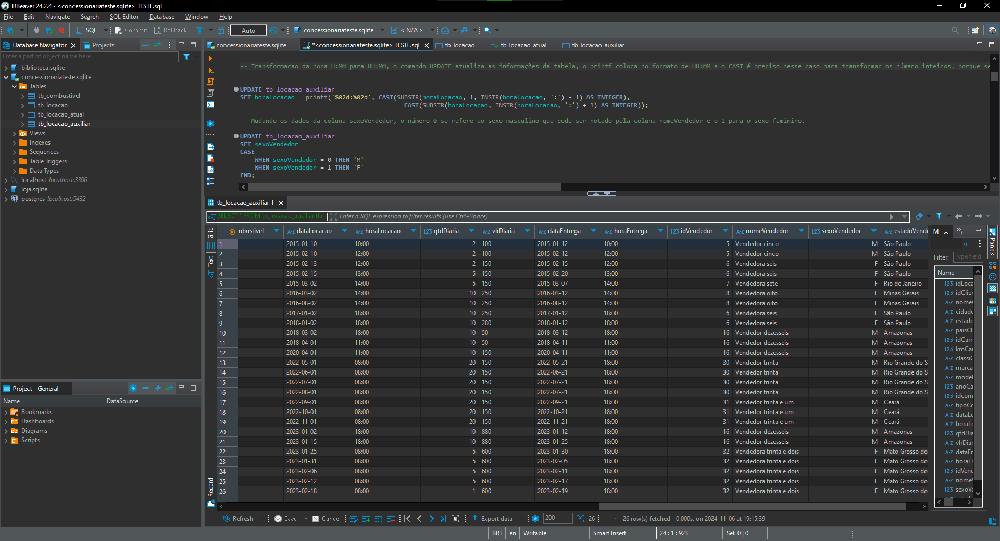

[**Voltar ao Sumário**](#sumário)

5. ... [Etapa 5 - Criação das tabelas e normalização](#Etapa5)

    Primeiro é criado as tabelas de forma que separem elas por "objeto" (locacao_atual, carro, combustivel, cliente, vendedor), exemplificando, a tabela cliente criada esteja relacionada a todos os dados relacionado ao cliente para que não tenha dependências parciais e transitivas, respeitando a 2FN e 3FN, respectivamente. E sempre criando as tabelas a partir dos IDs fornecidos que serão as chaves primárias (PK - Primary Key) para cada respectiva tabela e serão chaves estrangeiras (FK - Foreign Key) para a tabela principal que será o tb_locacao_atual, é importante ressaltar que a coluna dataLocacao da tabela principal estava do tipo DATETIME e para essa nova tabela foi utilizado o formato DATE para que se siga a normalização e os tipos que foram seguidos foram todos da tabela original. E a coluna kmCarro foi mantida na tabela principal por ser uma coluna que está ligada com o próprio idLocacao e os dados da locação e não somente ao objeto carro, esse campo é uma importante informação para verificar a km a cada locação.

    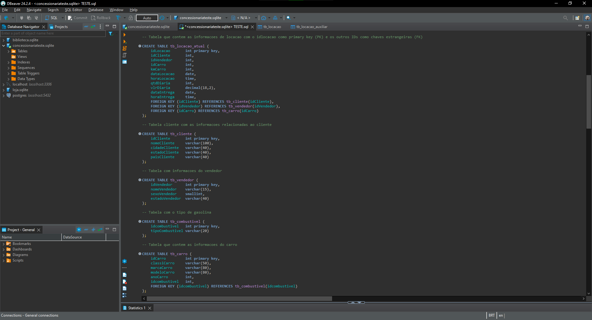

[**Voltar ao Sumário**](#sumário)

6. ... [Etapa 6 - Inserção dos dados nas novas tabelas](#Etapa6)

    Para a inserção dos dados foi utilizado o comando INSERT INTO em conjunto com o comando SELECT e DISTINCT que irá pegar os dados não duplicados, como por exemplo, os IDs que não podem ser repetidos para respeitar a 1FN e a unicidade da chave primária, em cada tabela que contém os "objetos", como carro, combustível, cliente, vendedor. E também foi utilizado o comando Order By para ordernar em relação ao ID. Para melhor visualização dos resultados das tabelas relacionais normalizadas, elas ficarão na parte de Anexo.

    - [tb_locacao_atual](#Anexo1)
    - [tb_carro](#Anexo2)
    - [tb_cliente](#Anexo3)
    - [tb_vendedor](#Anexo4)
    - [tb_combustivel](#Anexo5)
    - [Diagrama Entidade Relacionamento Modelo Relacional](#Anexo6)

    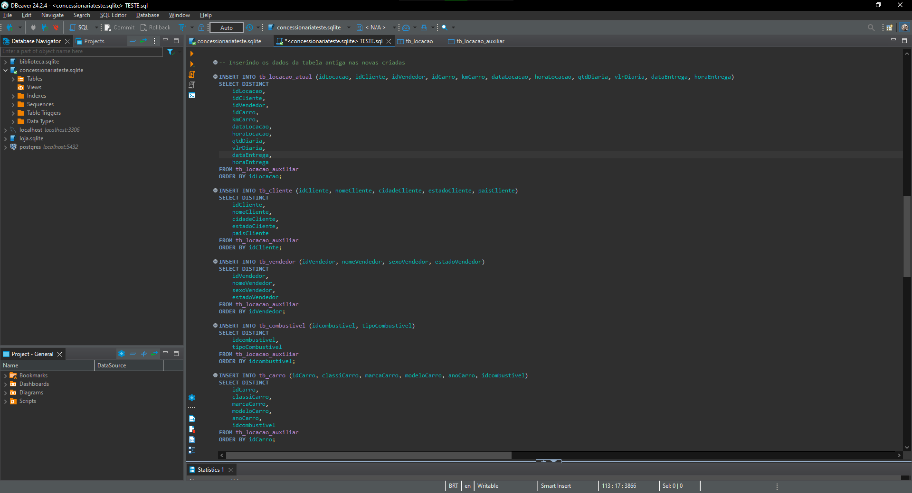

[**Voltar ao Sumário**](#sumário)

7. ... [Etapa 7 - Modelo Relacional para Dimensional](#Etapa7)

    No modelo dimensional foi decidido que também vai ser feito criação de tabelas para que seja visualizado o diagrama entidade relacionamento. Agora é separado as tabelas na tabela fato e as dimensões que são: carro, cliente, vendedor. Nas tabelas dimensões são mantidas as informações relacionadas a cada respectiva tabela dimensão. Como foi feito anteriormente, as tabelas são criadas pelo comando CREATE TABLE. Vale mencionar que durante a criação dessas tabelas foi mudado o nome da coluna para uma melhor visualização de cada tabela.
    
    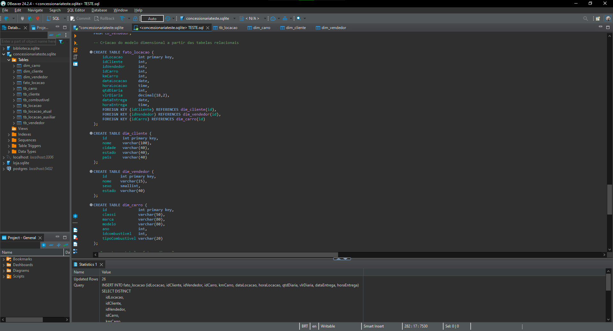

[**Voltar ao Sumário**](#sumário)

8. ... [Etapa 8 - Inserção dos dados no Modelo Dimensional](#Etapa8)

    Agora para a inserção de dados como foi feito anteriormente, com o comando SELECT e DISTINCT, o último caso houvesse alguma inconsistência dos dados e finalizado com um ORDER BY pelos IDs e utilizando as tabelas feitas pelo modelo relacional. Foi utilizado um JOIN com a finalidade de obter o tipo de combustível que foi diferente da tabela do modelo relacional (estava em uma tabela combustivel) que agora está junta com a tabela carro. Como feito anteriormente, as tabelas dimensão e fato estarão na parte de anexo.

    - [fato_locacao](#Anexo7)
    - [dim_carro](#Anexo8)
    - [dim_cliente](#Anexo9)
    - [dim_vendedor](#Anexo10)
    - [Diagrama Entidade Relacionamento Modelo Dimensional](#Anexo11)

    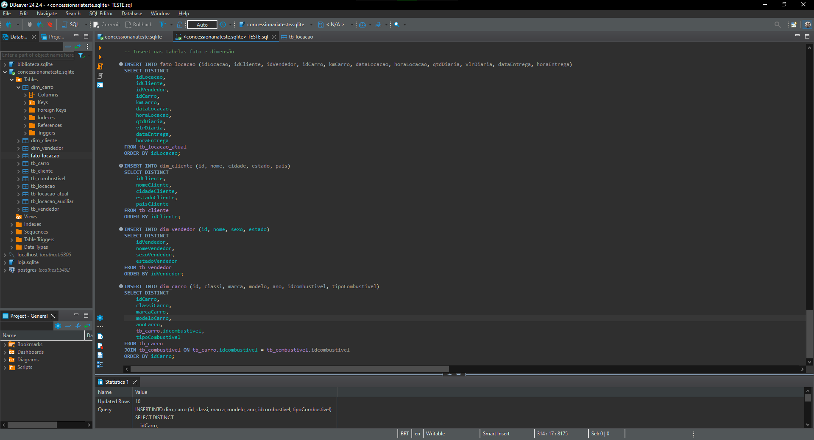

[**Voltar ao Sumário**](#sumário)

9. ... [Observações](#Observacoes)

    I. O relatório do dia 22/10/2024 teve um pequeno erro no começo da data que está no formato DD/MM/YYYY que não é o pedido pelo desafio, portanto, o problema foi arrumado no dia 24/10 e foi feito um novo relatório no dia 27/10 com a correção. O desafio pedia que o formato da data inicial fosse YYYY/MM/AA.

    

    II. Durante o dia 23/10/2024 tive um problema ao rodar script que fornecia um relatório com output errado, porém o problema foi resolvido por um conflito com arquivo CSV e não com o código do programa.

    

    III. O arquivo do crontab está localizado no diretório /var/spool/cron/crontabs da VM Linux Ubuntu.

    IV. dados_de_vendas.csv = 27/10/2024
        dados_de_vendas2.csv = 24/10/2024
        dados_de_vendas3.csv = 25/10/2024
        dados_de_vendas4.csv = 26/10/2024

[**Voltar ao Sumário**](#sumário)

## Anexos

1. ... [Anexo 1 - Tabela tb_locacao_atual](#Anexo1)

    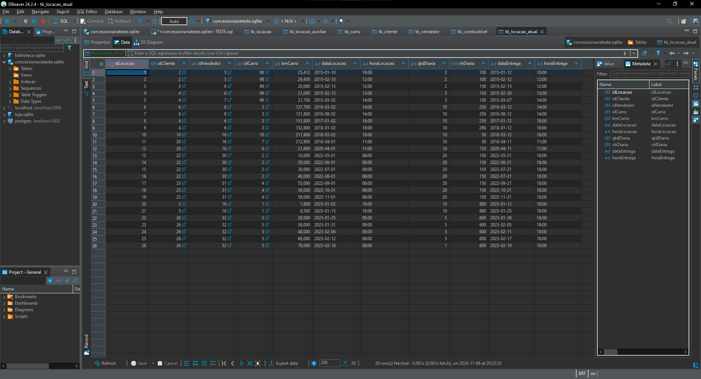

[**Voltar a Etapa 6**](#Etapa6)

[**Voltar ao Sumário**](#sumário)

2. ... [Anexo 2 - Tabela tb_carro](#Anexo2)

    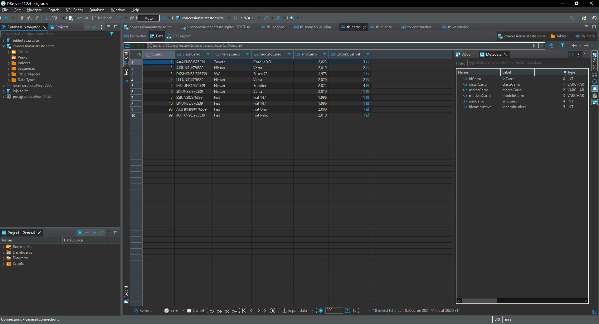

[**Voltar a Etapa 6**](#Etapa6)

[**Voltar ao Sumário**](#sumário)

3. ... [Anexo 3 - Tabela tb_cliente](#Anexo3)

    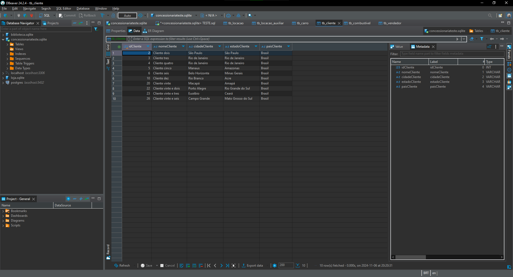

[**Voltar a Etapa 6**](#Etapa6)

[**Voltar ao Sumário**](#sumário)

4. ... [Anexo 4 - Tabela tb_vendedor](#Anexo4)

    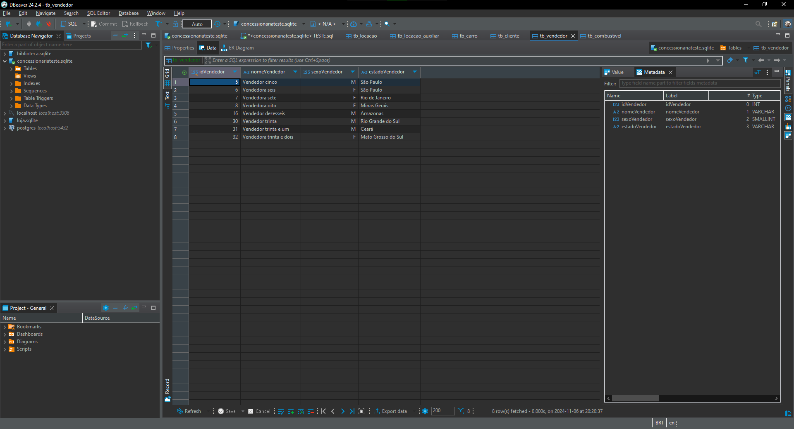

[**Voltar a Etapa 6**](#Etapa6)

[**Voltar ao Sumário**](#sumário)

5. ... [Anexo 5 - Tabela tb_combustivel](#Anexo5)

    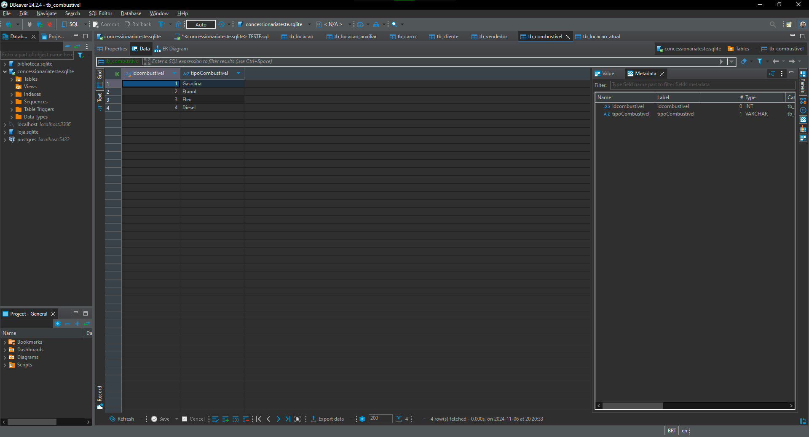

[**Voltar a Etapa 6**](#Etapa6)

[**Voltar ao Sumário**](#sumário)

6. ... [Anexo 6 - Diagrama Entidade Relacionamento Modelo Relacional](#Anexo6)

    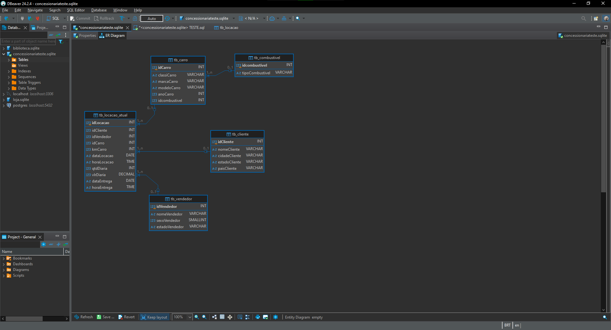

[**Voltar a Etapa 6**](#Etapa6)

[**Voltar ao Sumário**](#sumário)

7. ... [Anexo 7 - Tabela fato_locacao](#Anexo7)

    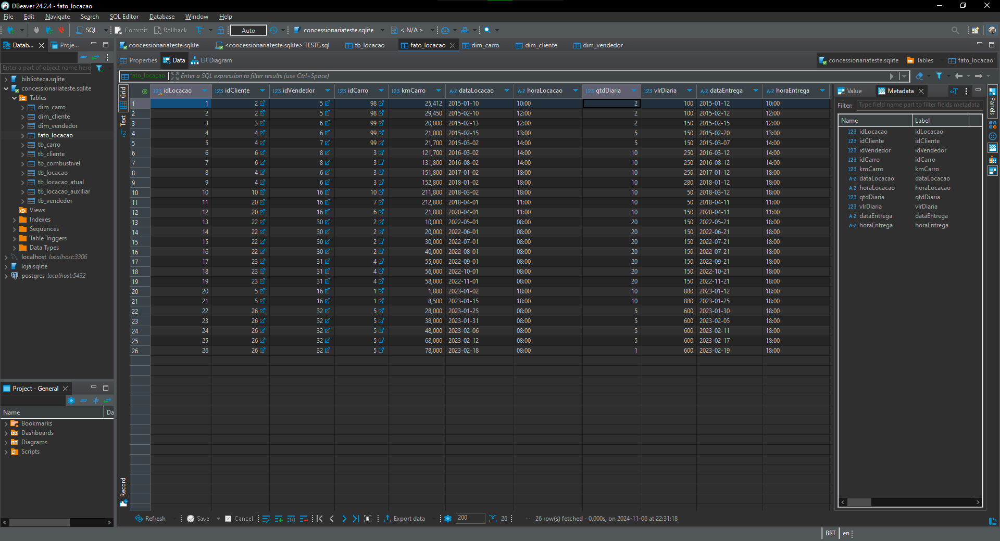

[**Voltar a Etapa 8**](#Etapa8)

[**Voltar ao Sumário**](#sumário)

8. ... [Anexo 8 - Tabela dim_carro](#Anexo8)

    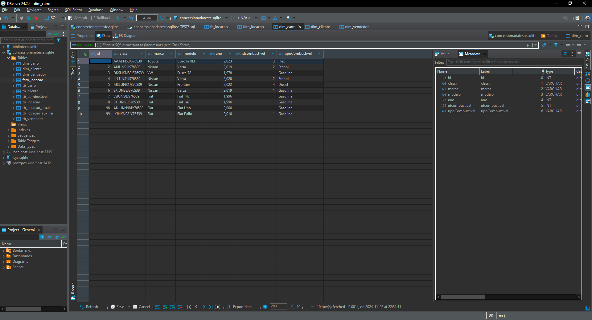

[**Voltar a Etapa 8**](#Etapa8)

[**Voltar ao Sumário**](#sumário)

9. ... [Anexo 9 - Tabela dim_cliente](#Anexo9)

    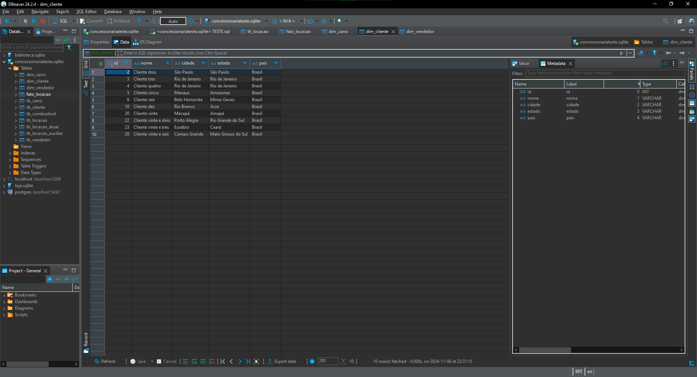

[**Voltar a Etapa 8**](#Etapa8)

[**Voltar ao Sumário**](#sumário)

10. ... [Anexo 10 - Tabela dim_vendedor](#Anexo10)

    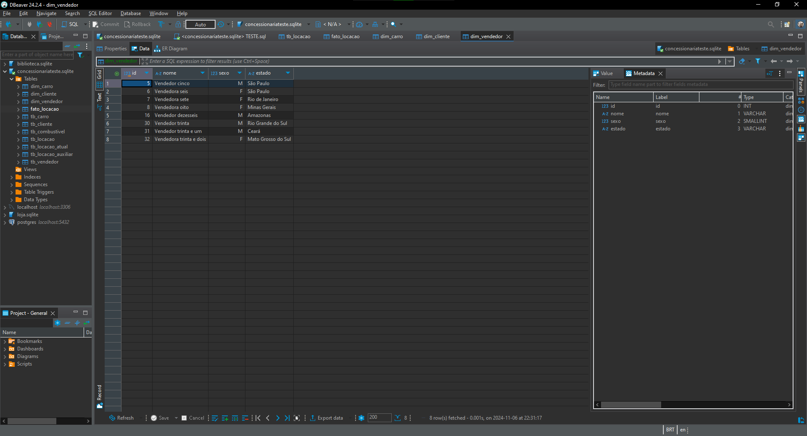 

[**Voltar a Etapa 8**](#Etapa8)   

[**Voltar ao Sumário**](#sumário)

11. ... [Anexo 11 - Diagrama Entidade Relacionamento Modelo Dimensional](#Anexo10)

     

[**Voltar a Etapa 8**](#Etapa8)   

[**Voltar ao Sumário**](#sumário)

12. ... [Anexo 12 - Versão do DBeaver](#Anexo12)

    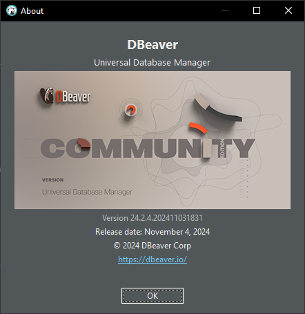 

[**Voltar a Etapas**](#Etapas)

[**Voltar ao Sumário**](#sumário)

13. ... [Anexo 13 - Versão do SQLite](#Anexo13)

    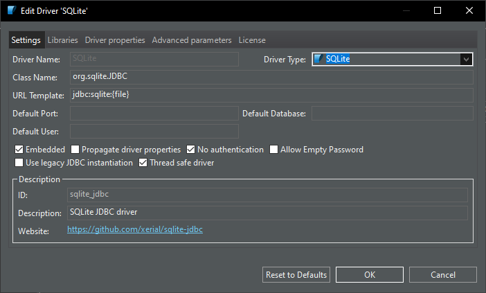
    
    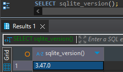

[**Voltar a Etapas**](#Etapas)

[**Voltar ao Sumário**](#sumário)