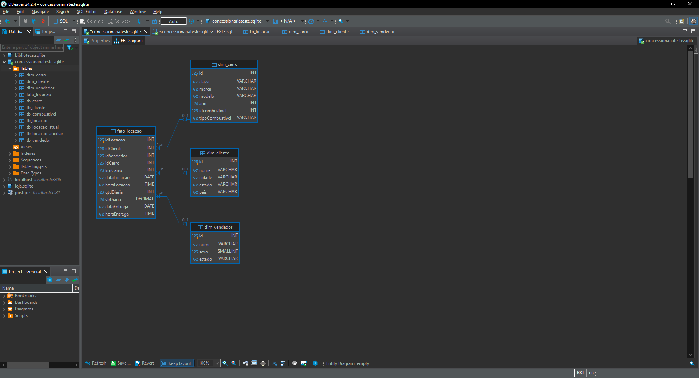
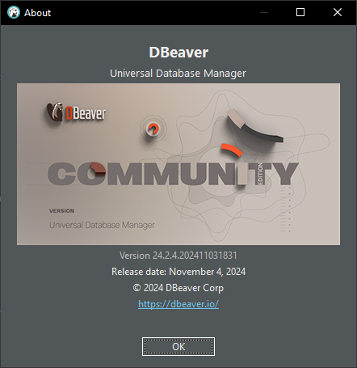
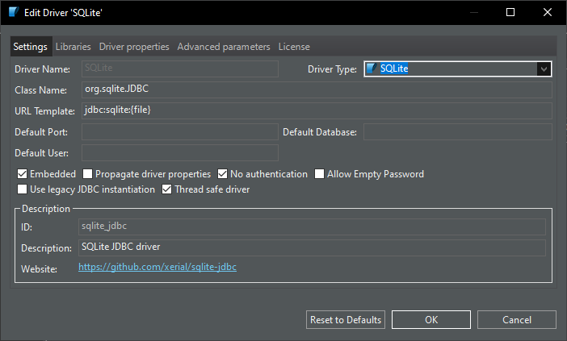
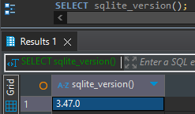
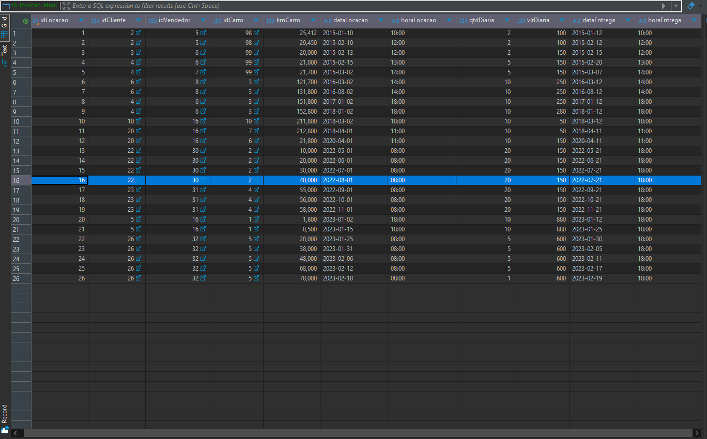

# Sumário

### Desafio:

1. [Script SQL](SCRIPT_SQL.sql)

2. [Banco de Dados Concessionaria após utilizado o Script](concessionaria_atual.sqlite)

3. [Diagrama Entidade Relacionamento Modelo Relacional](<../Evidencias/Desafio/ANEXO6_-_DIAGRAMA_ER.png>)

4. [Diagrama Entidade Relacionamento Modelo Dimensional](<../Evidencias/Desafio/ANEXO11_-_DIAGRAMA_ER_MODELO_DIMENSIONAL.png>)

1. [Etapas](#etapas)

    I.    [Etapa 1 - Verificação dos dados da tabela](#Etapa1)

    II.   [Etapa 2 - Tratamento de dados](#Etapa2)

    III.  [Etapa 3 - Criação de uma tabela auxiliar e o primeiro tratamento de dados](#Etapa3)

    IV.   [Etapa 4 - Finalização do tratamento de dados](#Etapa4)

    V.    [Etapa 5 - Criação das tabelas e normalização](#Etapa5)

    VI.   [Etapa 6 - Inserção dos dados nas novas tabelas](#Etapa6)

    VII.  [Etapa 7 - Modelo Relacional para Dimensional](#Etapa7)

    VIII. [Etapa 8 - Inserção dos dados no Modelo Dimensional](#Etapa8)

    IX.   [Observações](#Observacoes)

2. [Anexos](#anexos)

    I.    [Anexo 1 - Tabela tb_locacao_atual](#Anexo1)

    II.   [Anexo 2 - Tabela tb_carro](#Anexo2)

    III.  [Anexo 3 - Tabela tb_cliente](#Anexo3)

    IV.   [Anexo 4 - Tabela tb_vendedor](#Anexo4)

    V.    [Anexo 5 - Tabela tb_combustivel](#Anexo5)

    VI.   [Anexo 6 - Diagrama Entidade Relacionamento Modelo Relacional](#Anexo6)

    VII.  [Anexo 7 - Tabela fato_locacao](#Anexo7)

    VIII. [Anexo 8 - Tabela dim_carro](#Anexo8)

    IX.   [Anexo 9 - Tabela dim_cliente](#Anexo9)

    X.    [Anexo 10 - Tabela dim_vendedor](#Anexo10)

    XI.   [Anexo 11 - Diagrama Entidade Relacionamento Modelo Dimensional](#Anexo11)

    XII.  [Anexo 12 - Versão do DBeaver](#Anexo12) 

    XIII. [Anexo 13 - Versão do SQLite](#Anexo13)      

### README:

1. [README Principal](../../README.md)

2. [README Sprint 2](../README.md)

# Etapas

Explicação do desenvolvimento da normalização da tabela e criação do Modelo Relacional e Dimensional. Para o desenvolvimento foi utilizado o DBeaver Version 24.2.4.202411031831 (Release Date 04/11/2024) e SQLITE version 3.47.0. (Release Date 21/10/2024) para mais informações: [Anexo 12 - Versão do DBeaver](#Anexo12) e [Anexo 13 - Versão do SQLite](#Anexo13). 

1. ... [Etapa 1 - Verificação dos dados da tabela](#Etapa1)

    Inicialmente verifica-se os dados que contém na tabela (tb_locacao) e percebe-se que alguns dados devem ser tratados antes de começar o processo de normalização (a imagem representa apenas uma parte dela, os dados que serão tratados vão ser mostrados na etapa seguinte).
    
    

[**Voltar ao Sumário**](#sumário)

2. ... [Etapa 2 - Tratamento de dados](#Etapa2)

    As colunas dataLocacao e dataEntrega aparecem em um formato não desejado (YYYYMMDD) para as datas e é diferente dos exercícios feitos no SQL que estão no formato YYYY-MM-DD, a coluna de horaLocacao alguns horários estão no formato H:MM e não no formato HH:MM e finalmente a coluna sexoVendedor que está em um "formato binário". Para uma melhor visualização dos dados dessa coluna será trocado por M que corresponde ao sexo masculino e F para o sexo feminino.

    

[**Voltar ao Sumário**](#sumário)

3. ... [Etapa 3 - Criação de uma tabela auxiliar e o primeiro tratamento de dados](#Etapa3)

    Primeiro é importante ressaltar que no SQLITE é difícil de utilizar o comando ALTER TABLE para alterar a tabela, por isso foi decidido que é necessário criar tabelas novas (poderiam ser criadas views também). Portanto, foi criado uma tabela auxiliar e a cópia da original para que caso haja perda de dados ou alterações errôneas esses dados da tabela sejam mantidos, pois assim irá ser utilizado o comando UPDATE que consequentemente vai fazer a alteração dos valores da tabela original. Assim, executamos o comando UPDATE com o auxílio da função printf que coloca o "formato" de saída desejado que é YYYY-MM-DD e juntamente com a função SUBSTR que retorna uma string a partir da posição dada e o tamanho dela.

    

[**Voltar ao Sumário**](#sumário)

4. ... [Etapa 4 - Finalização do tratamento de dados](#Etapa4)

    Agora é feito o tratamento de dados referente às horas que começa com o comando UPDATE e também se utiliza a função printf que foi usado anteriormente, só que agora o formato será HH:MM e logo se utiliza a função CAST para que os números sejam retornados como inteiro, pois se caso não se faça isso o horário irá retornar como H:MM para alguns horários, também se utiliza o comando SUBSTR que vai pegar a string e retornar a posição inicial que é dada até o tamanho que se deseja e também é utilizada a função INSTR que é necessária, diferentemente do tratamento anterior, porque no tratamento anterior não havia um problema da data que em vez de retornar 01, ele poderia retornar 1, ou seja, uma opção que tem um número e outra que tem dois números. Portanto, a função tem o objetivo de encontrar até o separador ":" subtraindo uma unidade para que o tamanho da função SUBSTR seja até às horas (HH), após isso é feito esse mesmo procedimento para os minutos.
    Para o sexoVendedor também é utilizado o comando UPDATE em conjunto com o comando CASE que irá substituir o valor toda vez que corresponda ao valor dado, que no caso o "0" corresponde ao "M" e o "1" corresponde ao "F". Por fim é finalizado os dados inconsistentes da tabela.

    

[**Voltar ao Sumário**](#sumário)

5. ... [Etapa 5 - Criação das tabelas e normalização](#Etapa5)

    Primeiro é criado as tabelas de forma que separem elas por "objeto" (locacao_atual, carro, combustivel, cliente, vendedor), exemplificando, a tabela cliente criada esteja relacionada a todos os dados relacionados ao cliente para que não tenha dependências parciais e transitivas, respeitando a 2FN e 3FN, respectivamente. E sempre criando as tabelas a partir dos IDs fornecidos que serão as chaves primárias (PK - Primary Key) para cada respectiva tabela e também serão chaves estrangeiras (FK - Foreign Key) para a tabela principal que será o tb_locacao_atual, é importante ressaltar que a coluna dataLocacao da tabela principal estava do tipo DATETIME e para essa nova tabela foi utilizado o formato DATE para que se siga a normalização (DATETIME pode colocar horário, assim tirando a atomicidade da data) e os tipos que foram seguidos foram todos da tabela original. A coluna kmCarro foi mantida na tabela principal por ser uma coluna que está ligada com o próprio idLocacao e os dados da locação e não somente ao objeto carro, portante, esse campo é uma importante informação para verificar a km para cada locação.

    

[**Voltar ao Sumário**](#sumário)

6. ... [Etapa 6 - Inserção dos dados nas novas tabelas](#Etapa6)

    Para a inserção dos dados foi utilizado o comando INSERT INTO em conjunto com o comando SELECT e DISTINCT que vai pegar os dados não duplicados, como por exemplo, os IDs que não podem ser repetidos para respeitar a 1FN e a unicidade da chave primária, em cada tabela que contém os "objetos", como carro, combustível, cliente, vendedor. E também foi utilizado o comando ORDER BY para ordernar em relação ao ID. Para a melhor visualização dos resultados das tabelas relacionais normalizadas, elas ficarão na parte de Anexo.

    - [tb_locacao_atual](#Anexo1)
    - [tb_carro](#Anexo2)
    - [tb_cliente](#Anexo3)
    - [tb_vendedor](#Anexo4)
    - [tb_combustivel](#Anexo5)
    - [Diagrama Entidade Relacionamento Modelo Relacional](#Anexo6)

    

[**Voltar ao Sumário**](#sumário)

7. ... [Etapa 7 - Modelo Relacional para Dimensional](#Etapa7)

    No modelo dimensional foi decidido que também, vai ser feito criação de novas tabelas. Agora é separado as tabelas na tabela fato que é a locação e as dimensões que são: carro, cliente, vendedor. Nas tabelas dimensões são mantidas as informações relacionadas a cada respectiva tabela dimensão. Como foi feito anteriormente, as tabelas são criadas pelo comando CREATE TABLE. Vale mencionar que durante a criação dessas tabelas foi mudado o nome da coluna para uma melhor visualização de cada tabela.
    
    

[**Voltar ao Sumário**](#sumário)

8. ... [Etapa 8 - Inserção dos dados no Modelo Dimensional](#Etapa8)

    Agora o processo de inserção de dados será feito igual ao anterior, com o comando SELECT e DISTINCT, o último comando é ainda utilizado caso houvesse alguma inconsistência dos dados e para finalizar foi utilizado ORDER BY pelos IDs novamente e para essa inserção foi utilizado as tabelas feitas pelo modelo relacional. O JOIN foi utilizado com a finalidade de obter o tipo de combustível que foi diferente da tabela do modelo relacional, que estava em uma tabela combustível e agora se encontra na tabela carro. Como foi feito anteriormente, as tabelas dimensão e fato estarão na parte de anexo.

    - [fato_locacao](#Anexo7)
    - [dim_carro](#Anexo8)
    - [dim_cliente](#Anexo9)
    - [dim_vendedor](#Anexo10)
    - [Diagrama Entidade Relacionamento Modelo Dimensional](#Anexo11)

    

[**Voltar ao Sumário**](#sumário)

9. ... [Observações](#Observacoes)

    I. Para os diagramas foi utilizado a notação Crow's Foot (pé de galinha) e o banco de dados não salva no DBeaver essa notação, portanto, ao abrir o arquivo ele vai estar no default do DBeaver que é a notação IDEF1X.

    II. Nas prints foi utilizado um arquivo de script de SQL chamado TESTE.SQL, porém ele corresponde ao que se encontra no README.

    III. Há alguns comandos em formato de comentário no script do SQL para caso haja uma necessidade de verificar o conteúdo das tabelas ou a exclusão delas.

    IV. A coluna kmCarro para uma melhor visualização de quanto o km do carro atual, poderia ser criado uma nova tabela que da um SELECT no idCarro e a kmCarro máxima com a função MAX e assim criar uma coluna nova na tabela do carro chamada kmCarro_atual assim manteria o kmCarro de cada aluguel e sempre pegando o máximo valor dessa tabela principal (utilizando JOINs).

    V. Para a criação do Modelo Dimensional poderia ter sido utilizado a criação de VIEWs a única observação é que com as VIEWs seria necessário a criação de JOINs para representar o Diagrama Entidade Relacionamento no software DBeaver.

    VI. Há um erro no dado da dataLocacao no idLocacao de número 16, a dataLocacao está numa data posterior a dataEntrega. [Anexo 14](#Anexo14)

[**Voltar ao Sumário**](#sumário)

## Anexos

1. ... [Anexo 1 - Tabela tb_locacao_atual](#Anexo1)

    

[**Voltar para Etapa 6**](#Etapa6)

[**Voltar ao Sumário**](#sumário)

2. ... [Anexo 2 - Tabela tb_carro](#Anexo2)

    

[**Voltar para Etapa 6**](#Etapa6)

[**Voltar ao Sumário**](#sumário)

3. ... [Anexo 3 - Tabela tb_cliente](#Anexo3)

    

[**Voltar para Etapa 6**](#Etapa6)

[**Voltar ao Sumário**](#sumário)

4. ... [Anexo 4 - Tabela tb_vendedor](#Anexo4)

    

[**Voltar para Etapa 6**](#Etapa6)

[**Voltar ao Sumário**](#sumário)

5. ... [Anexo 5 - Tabela tb_combustivel](#Anexo5)

    

[**Voltar para Etapa 6**](#Etapa6)

[**Voltar ao Sumário**](#sumário)

6. ... [Anexo 6 - Diagrama Entidade Relacionamento Modelo Relacional](#Anexo6)

    

[**Voltar para Etapa 6**](#Etapa6)

[**Voltar ao Sumário**](#sumário)

7. ... [Anexo 7 - Tabela fato_locacao](#Anexo7)

    

[**Voltar para Etapa 8**](#Etapa8)

[**Voltar ao Sumário**](#sumário)

8. ... [Anexo 8 - Tabela dim_carro](#Anexo8)

    

[**Voltar para Etapa 8**](#Etapa8)

[**Voltar ao Sumário**](#sumário)

9. ... [Anexo 9 - Tabela dim_cliente](#Anexo9)

    

[**Voltar para Etapa 8**](#Etapa8)

[**Voltar ao Sumário**](#sumário)

10. ... [Anexo 10 - Tabela dim_vendedor](#Anexo10)

     

[**Voltar para Etapa 8**](#Etapa8)   

[**Voltar ao Sumário**](#sumário)

11. ... [Anexo 11 - Diagrama Entidade Relacionamento Modelo Dimensional](#Anexo10)

     

[**Voltar para Etapa 8**](#Etapa8)   

[**Voltar ao Sumário**](#sumário)

12. ... [Anexo 12 - Versão do DBeaver](#Anexo12)

     

[**Voltar para as Etapas**](#Etapas)

[**Voltar ao Sumário**](#sumário)

13. ... [Anexo 13 - Versão do SQLite](#Anexo13)

    
    
    

[**Voltar para as Etapas**](#Etapas)

[**Voltar ao Sumário**](#sumário)

14. ... [Anexo 14 - dataLocacao](#Anexo14)

    
    
[**Voltar para as Observações**](#Observacoes)

[**Voltar ao Sumário**](#sumário)