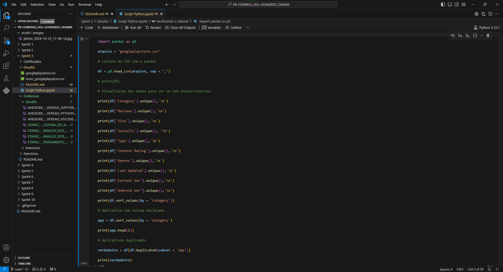
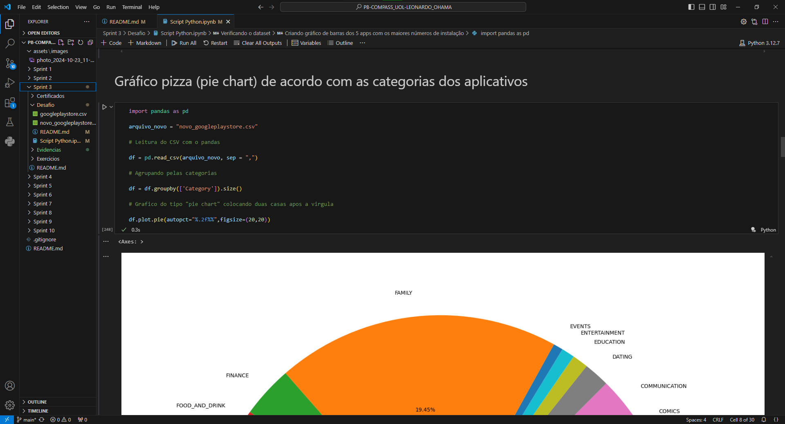
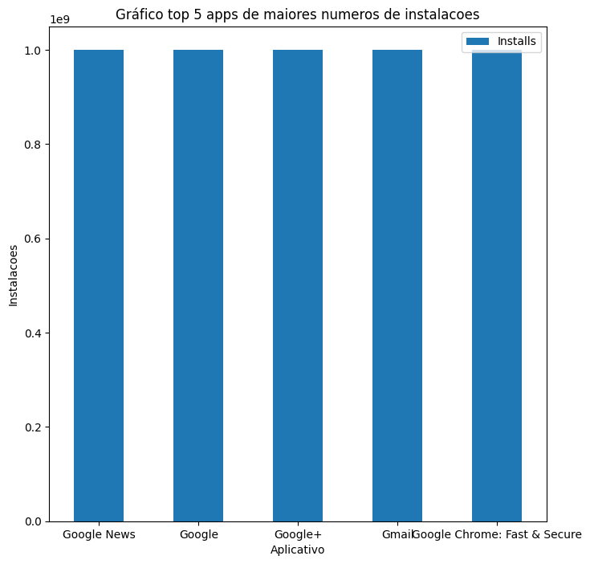

# Sumário

### Desafio:

1. [Google Play Store CSV](googleplaystore.csv)

2. [Google Play Store com dados tratados](novo_googleplaystore.csv)

3. [Script Python](<script_python.ipynb>)

1. [Etapas](#etapas)

    I.    [Etapa 1 - Verificação dos dados do dataset googleplaystore.csv](#Etapa1)

    II.   [Etapa 2 - Análise dos dados](#Etapa2)

    III.  [Etapa 3 - Retirado linhas duplicadas e tratamento de dados](#Etapa3)

    IV.   [Etapa 4 - Criação do gráfico de barras dos 5 apps com os maiores números de instalação](#Etapa4)

    V.    [Etapa 5 - Gráfico pizza divididos pela categoria dos aplicativos](#Etapa5)

    VI.   [Etapa 6 - Aplicativo mais caro do dataset](#Etapa6)

    VII.  [Etapa 7 - Quantidade de aplicativos com Content Rating Mature 17+](#Etapa7)

    VIII. [Etapa 8 - Top 10 aplicativos pelo número de reviews](#Etapa8)

    IX.   [Etapa 9 - Arquivo mais pesado do dataset](#Etapa9)

    X.    [Etapa 10 - Arquivo mais leve do dataset](#Etapa10)

    XI.   [Etapa 11 - Top 10 jogos mais caros](#Etapa11)

    XII.  [Etapa 12 - Quantidade de aplicativos divididos pelo preço](#Etapa12)

    XIII. [Etapa 13 - Quantidade de aplicativos por Content Rating](#Etapa13)

    XIV.  [Observações](#Observacoes)

2. [Anexos](#anexos)

    I.    [Anexo 1 - Gráfico top 5 instalações](#Anexo1)

    II.   [Anexo 2 - Gráfico separado por categorias](#Anexo2)

    III.  [Anexo 3 - Gráfico Quantidade x Preço](#Anexo3)

    IV.   [Anexo 4 - Gráfico 1 Quantidade de aplicativos por Content Rating](#Anexo4)

    V.    [Anexo 5 - Gráfico 2 Quantidade de aplicativos por Content Rating](#Anexo5)

    VI.   [Anexo 6 - Versão VSCode](#Anexo6)

    VII.  [Anexo 7 - Versão extensão Jupyter no VSCode](#Anexo7)

    VIII. [Anexo 8 - Versão do Python](#Anexo8)

### README:

1. [README Principal](../../README.md)

2. [README Sprint 3](../README.md)

# Etapas

Explicação do desenvolvimento do tratamento de dados, criação de gráficos e dados relevantes para uma análise do dataset googleplaystore.csv que contém os dados de aplicativos Android na Google Play Store em formato csv. Para o desenvolvimento foi utilizado o VSCode Version 1.95.3 (Release Date 13/11/2024), extensão Jupyter para o VSCode v2024.10.0. (Release Date 19/11/2024), Python 3.12.7, matplotlib Version 3.9.2, numpy Version 2.1.2, pandas Version 2.2.3, pip Version 24.3.1, para mais informações: [Anexo 6 - Versão VSCode](#Anexo6), [Anexo 7 - Versão extensão Jupyter no VSCode](#Anexo7) e [Anexo 8 - Versão do Python](#Anexo8). 

1. ... [Etapa 1 - Verificação dos dados do dataset googleplaystore.csv](#Etapa1)

    Primeiramente é importado a biblioteca pandas para a leitura do arquivo googleplaystore.csv com a função read_csv e logo após é utilizado o comando print para verificar os dados dentro do arquivo csv, com o dataframe gerado imprime-se todas as colunas para a verificação de dados que estão deslocados ou NaN (Not a Number) que podem prejudicar as análises que serão feitos em seguida, o aplicativo que está com os valores deslocados e vai ser mostrado na etapa seguinte e também os aplicativos que estão duplicados utilizando o subset para filtrar pela coluna "App".

    

[**Voltar ao Sumário**](#sumário)

2. ... [Etapa 2 - Análise dos dados](#Etapa2)

    Com os resultados dos prints é possível ver que, por exemplo na coluna Category há um dado "1.9", dados NaN em colunas como Category e com isso foi utilizado o comando sort_values pela coluna Category para verificar a linha que tem valor "1.9" e todos os valores que contém nele. Com isso foi possível achar que o aplicativo "Life Made WI-Fi Touchscreen Photo Frame" está com os dados deslocados e os valores duplicados que são 1181 no total.

    

    

    

[**Voltar ao Sumário**](#sumário)

3. ... [Etapa 3 - Retirado linhas duplicadas e tratamento de dados](#Etapa3)

    Encontrado os problemas do dataset, em primeiro é feito a retirada de dados duplicados com base na linha que tiver o maior número de reviews (avaliações) e a linha que contém o aplicativo "Life Made WI-Fi Touchscreen Photo Frame" é deletado pela incerteza dos dados só estarem deslocados uma coluna, ou todos os dados estiverem bagunçados entre si. Logo após isso, é feito o tratamento dos dados NaN, na coluna "Type" que consiste em falar se o arquivo é pago ou não pago é utilizado NA que uma das abreviações é "no answer", ou seja, não se tem informação, essa abreviação é utilizado também na coluna Android Ver, essa coluna consiste em mostra a versão de Android que esse aplicativo está disponível e para coluna de Content Rating é utilizado o Unrated que significa sem classificação, após isso é gerado o novo csv, vale lembrar que é feito um novo arquivo csv, a fim de se preservar os dados originais e caso haja alguma alteração indesejada é rapidamente pego o backup do arquivo original. O arquivo final contém 9960 linhas de dados.

    

    

[**Voltar ao Sumário**](#sumário)

4. ... [Etapa 4 - Criação do gráfico de barras dos 5 apps com os maiores números de instalação](#Etapa4)

    Para efetuar o gráfico, primeiro é necessário que seja feito uma organização dos dados, ou seja, seja ordenado com os aplicativos que têm os maiores números de instalação, para isso primeiro é utilizado as funções str e replace(), o primeiro para transformar esses dados da coluna Reviews em string e o replace para retirar o símbolo de "+" e o de ",", depois disso é utilizado a função to_numeric() do pandas para transformar em números de volta, agora é utilizado o sort_values() para ordenar em ordem decrescente pela coluna Reviews e logo após isso é utilizado a função head(5) para guardar os 5 aplicativos com os maiores números de instalação. No final é "plotado" o gráfico pelo pandas, sendo o eixo x o nome do aplicativo e o eixo y o número de instalações (na instalações os valores estão sendo 1x10^9). [Observação I](#Observacoes)

    [Gráfico top 5 Instalações](#Anexo1)

    

[**Voltar ao Sumário**](#sumário)

5. ... [Etapa 5 - Gráfico pizza divididos pela categoria dos aplicativos](#Etapa5)

    Para separar os dados em categorias, primeiro é agrupado com groupby() pela coluna Category juntamente com a função size() que vai contabilizar esse agrupamento, depois é utilizado o plot.pie para criar o gráfico pizza e também é utilizado autopct="%.2f%%" para colocar em duas casas decimais as porcentagens de ocorrência do aplicativo no gráfico. [Observação II](#Observacoes)

    [Gráfico separado por categorias](#Anexo2)

    

[**Voltar ao Sumário**](#sumário)

6. ... [Etapa 6 - Aplicativo mais caro do dataset](#Etapa6)

    Agora para procurar o aplicativo mais caro, foi utilizado a mesma estratégia da etapa 4 (gráfico top 5 maiores número de instalação) que é retirar o símbolo "$" (coluna "Price") pelo replace() e com o str e logo depois transformado em números com to_numeric(), logo após, ordenado em forma decrescente pela coluna "Price", depois disso é colocado o símbolo "$" e a função head() para apresentar o aplicativo mais caro.

    

[**Voltar ao Sumário**](#sumário)

7. ... [Etapa 7 - Quantidade de aplicativos com Content Rating Mature 17+](#Etapa7)

    Nessa etapa é utilizado a função len() para contar a quantidade de linhas que contém o dataframe com Mature 17+ na coluna Content Rating e é contabilizado 393 aplicativos com essas condições.
    
    

[**Voltar ao Sumário**](#sumário)

8. ... [Etapa 8 - Top 10 aplicativos pelo número de reviews](#Etapa8)

    Primeiro é transformado os dados da coluna Reviews em números pelo to_numeric() já utilizado anteriormente e logo após utilizado o sort_values() para ordenar em ordem decrescente pela coluna Reviews e finalmente utilizado o comando head() para apresentar os 10 maiores valores pelo número de reviews.

    

[**Voltar ao Sumário**](#sumário)

9. ... [Etapa 9 - Arquivo mais pesado do dataset](#Etapa9)

    Para encontrar o arquivo mais pesado, o filtro para encontrá-lo é pela coluna "Size", como não há arquivos mais pesados que Mega (M), então é retirado essa letra com a função replace e o comando str, logo após a retirada ele é transformado em número com to_numeric(), assim pode-se ordernar em forma decrescente com o sort_values() e depois disso, é colocado de volta a letra M (Mega) e finalmente utilizado a função head() apresentando somente o primeiro valor.

    

[**Voltar ao Sumário**](#sumário)

10. ...[Etapa 10 - Arquivo mais leve do dataset](#Etapa10)

    Nessa etapa é feito o mesmo procedimento da etapa anterior, a diferença maior fica na parte para filtrar que antes era com a letra M, agora é com a letra k que tem um "peso" menor que o mega e como não têm valores em bytes, os arquivos com k serão os mais leves. E uma segunda diferença com a etapa anterior é que na etapa 10 é mostrado o valor e o nome do arquivo (utilizando o comando iloc que é possível manipular a linha e coluna que devem ser apresentados) em vez de uma lista.

    

[**Voltar ao Sumário**](#sumário)

11. ...[Etapa 11 - Top 10 jogos mais caros](#Etapa11)

    Para achar os jogos mais caros do dataset é utilizado o mesmo procedimento, que consiste em retirar o símbolo "$" e depois transformar em número, a diferença nessa etapa vai ser filtrar pela coluna Category e trazer somente os valores que contém "Game" e logo após disso é utilizado o sort_values() para a ordernação decrescente.

    

[**Voltar ao Sumário**](#sumário)

12. ...[Etapa 12 - Quantidade de aplicativos divididos pelo preço](#Etapa12)

    Para essa etapa novamente é utilizado o procedimento de retirar o símbolo "$" e até a ordenação, depois disso é criado em listas os intervalos que vai ser utilizado para a confecção do gráfico, no caso é utilizado em passo de 5 em 5, depois de 10 em 10 e por último de 100 em 100. Para colocar os intervalos na tabela é utilizado a função cut do pandas com os respectivos intervalos incluindo os valores que contém o valor 0, logo depois é feito a ordenação e nessa linha de comando é utilizado o reset_index() para que se consiga colocar o nome da coluna "Quantidade" que é feito logo em seguida com o .columns e no final é feito o print para a visualização da tabela.

    

    

    Para a confecção do gráfico primeiro utilizado a biblioteca matplotlib, primeiramente é utilizado a função figure(), ajustando o tamanho da figura do gráfico e depois "plotamos" o gráfico com os valores da coluna "Intervalo (USD)" criado anteriomente com a coluna "Quantidade", a linha utilizada vão ser vários pontos com a utilização do linestyle, para colocar onde os pontos se encontram é utilizado o marker e a cor da linha utilizado é verde. Depois é colocado o nome de cada eixo para o eixo das abscissas é colocado o nome da coluna "Intervalo (USD)", nas ordenadas "Quantidade" e o título do gráfico. Para melhor visualização rotacionamos os valores das abscissas em 45 graus, também é colocado grades em pontilhados para uma melhor experiência de consumir o gráfico e no final é produzido o gráfico.

    [Gráfico Quantidade x Preço](#Anexo3)

    

[**Voltar ao Sumário**](#sumário)

13. ...[Etapa 13 - Quantidade de aplicativos por Content Rating](#Etapa13)

    Nessa etapa primeiro é feito a utilização da função value_counts() do pandas na coluna "Content Rating" para que seja contabilizado a quantidade de valores dessa colunas com o sort_index() que ordena e o reset_index() para que seja nomeado essas colunas ("Content Rating" e "Quantidade") e logo após é feito o print() para a visualização dessa tabela.

    

    

    Primeiro é guardado em variaveis as colunas "Content Rating" e "Quantidade" e em seguida é feito a criação do gráfico do tipo "stack" com as colunas "Content Rating" que será o eixo x e o eixo y será a coluna "Quantidade", logo após é feito a delimitação dos eixos do gráfico, desse modo, é nomeado cada eixo e o título do gráfico e finalmente é gerado o gráfico com grades.

    [Gráfico 1 Quantidade de aplicativos por Content Rating](#Anexo4)

    

    No segundo gráfico é feito um tratamento de dados pequeno, porque será utilizado o gráfico do tipo pizza e ele pode sobrepor valores caso eles sejam muito pequenos, para isso todos os valores menores ou iguais a 10 serão agrupados em uma nova linha chamado "Outros", desta forma, é utilizado a função where na coluna "Quantidade" que vai localizar os valores menores que 10 e depois disso é agrupado esses valores somando eles com as funções groupby() e sum(), depois disso é feito uma lista de cores que serão utilizados para o gráfico e é criado o gráfico com a função subplots(). Em seguida, é utilizado o tipo do gráfico como "pie", utilizando como base a coluna "Quantidade", os valores serão apresentados em porcentagem com 2 casas decimais e é utilizado a lista de cores criados anteriormente. Assim, é criado o título do gráfico e sua legenda que estará localizado no canto de cima direito e finalmente é construído o gráfico.

    [Gráfico 2 Quantidade de aplicativos por Content Rating](#Anexo5)    

    

[**Voltar ao Sumário**](#sumário)

9. ... [Observações](#Observacoes)

    I. No gráfico de top 5 instalações da [etapa 4](#Etapa4), talvez o ideal seria mudar alguns critérios ou pegar os números reais de instalação, porque as barras do gráfico ficaram homegêneas e também há outros dados que têm o mesmo valor ficando só uma amostra dos valores. 

    II.No gráfico que agrupa os aplicativos por categoria da [etapa 5](#Etapa5) talvez seria ideal agrupar os grupos menores para que tivesse uma melhor visualização do gráfico pizza, ou também mudar os critérios.

[**Voltar ao Sumário**](#sumário)

## Anexos

1. ... [Anexo 1 - Gráfico top 5 instalações](#Anexo1)

    

[**Voltar para Etapa 4**](#Etapa4)

[**Voltar ao Sumário**](#sumário)

2. ... [Anexo 2 - Gráfico separado por categorias](#Anexo2)

    

[**Voltar para Etapa 5**](#Etapa5)

[**Voltar ao Sumário**](#sumário)

3. ... [Anexo 3 - Gráfico Quantidade x Preço](#Anexo3)

    

[**Voltar para Etapa 12**](#Etapa12)

[**Voltar ao Sumário**](#sumário)

4. ... [Anexo 4 - Gráfico 1 Quantidade de aplicativos por Content Rating](#Anexo4)

    

[**Voltar para Etapa 13**](#Etapa13)

[**Voltar ao Sumário**](#sumário)

5. ... [Anexo 5 - Gráfico 2 Quantidade de aplicativos por Content Rating](#Anexo5)

    

[**Voltar para Etapa 13**](#Etapa13)

[**Voltar ao Sumário**](#sumário)

6. ... [Anexo 6 - Versão VSCode](#Anexo6)

    

[**Voltar para Etapas**](#Etapas)

[**Voltar ao Sumário**](#sumário)

7. ... [Anexo 7 - Versão extensão Jupyter no VSCode](#Anexo7)

    

[**Voltar para Etapas**](#Etapas)

[**Voltar ao Sumário**](#sumário)

8. ... [Anexo 8 - Versão do Python](#Anexo8)

    

[**Voltar para Etapas**](#Etapas)

[**Voltar ao Sumário**](#sumário)
