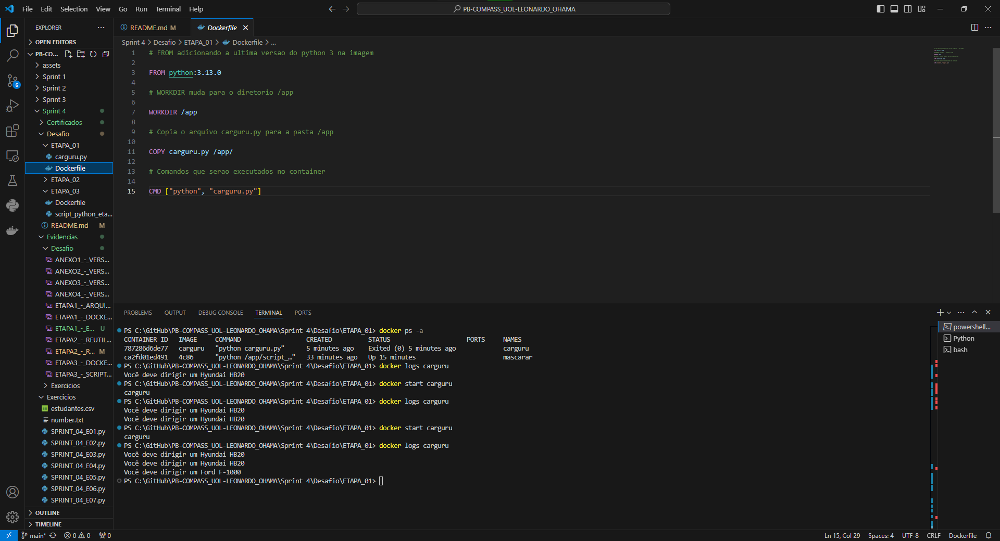
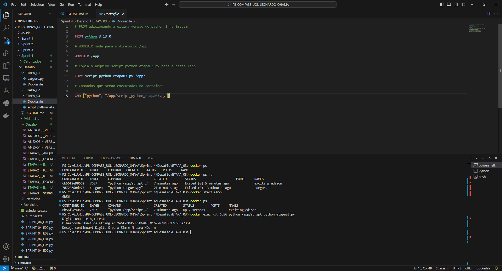
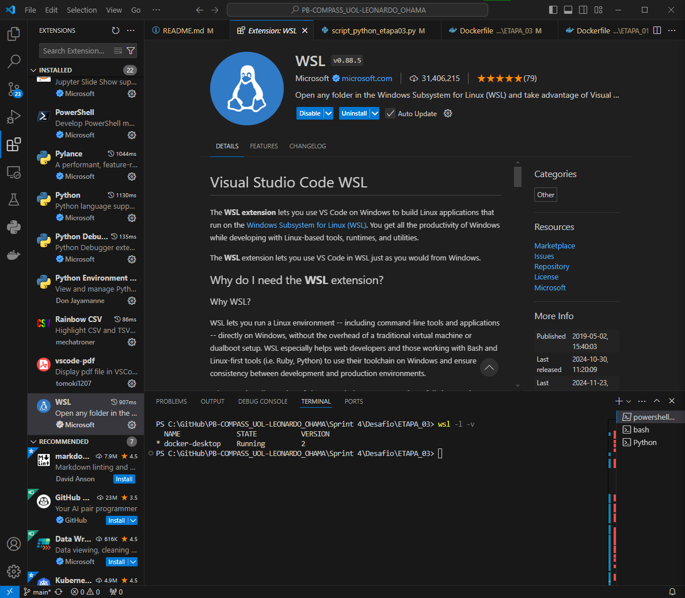

# Sumário

### Desafio:

1. [Dockerfile Etapa 01](ETAPA_01/Dockerfile)

2. [Dockerfile Etapa 03](ETAPA_03/Dockerfile)

3. [Script Python Etapa 03](ETAPA_03/script_python_etapa03.py)

1. [Etapas](#etapas)

    I.    [Etapa 1 - Criação do Dockerfile para o arquivo carguru.py](#Etapa1)

    II.   [Etapa 2 - Reutilização de Containers](#Etapa2)

    III.  [Etapa 3 - Dockerfile e script Python que gera um hashcode com algoritmo SHA-1 por meio de input](#Etapa3)

    IV.   [Observações](#Observacoes)

2. [Anexos](#anexos)

    I.    [Anexo 1 - Versão VSCode](#Anexo1)

    II.   [Anexo 2 - Versão extensão Docker VSCode](#Anexo2)

    III.  [Anexo 3 - Versão Docker](#Anexo3)

    IV.   [Anexo 4 - Versão WSL](#Anexo4)

### README:

1. [README Principal](../../README.md)

2. [README Sprint 4](../README.md)

# Etapas

Explicação do desenvolvimento de containers com o Docker em programas Python e a explicação se é possível reutilizar container já criados por imagem. Para o desenvolvimento foi utilizado o VSCode Version 1.95.3 (Release Date 13/11/2024), Docker extensão para o VSCODE v1.29.3, Docker Desktop Version 4.36.0 (175267), Python Version 3.13.0 (Container), WSL 2, para mais informações: [Anexo 1 - Versão VSCode](#Anexo1), [Anexo 2 - Versão extensão Docker VSCode](#Anexo2), [Anexo 3 - Versão Docker](#Anexo3) e [Anexo 4 - Versão WSL](#Anexo4). 

1. ... [Etapa 1 - Criação do Dockerfile para o arquivo carguru.py](#Etapa1)

    Primeiramente é criado o arquivo Dockerfile e logo em seguida é adicionado a linha de comando FROM python:3 para criar uma imagem de Python 3 na última versão, depois é utilizado o WORKDIR para mudar no diretório /app/ do container, e em seguida é escrito o comando "COPY carguru.py /app/" para copiar o arquivo carguru.py na pasta /app/ e finalmente com o comando "CMD ["python", "carguru.py"]" ele define os comandos que serão executados após a inicialização do container, ou seja, vai executar em Python o arquivo carguru.py.

    

    

[**Voltar ao Sumário**](#sumário)

2. ... [Etapa 2 - Reutilização de Containers](#Etapa2)

    É possível reutilizar os containers no Docker, se caso o container não estiver ativo, basta executar o comando "docker start CONTAINERID" para inicializar o container que já foi criado por uma imagem e logo depois executar com o comando "docker exec CONTAINERID ARGUMENTOS", por exemplo se for reutilizado o container criado na próxima etapa, primeiro se usa o "docker start CONTAINERID" e em seguida "docker exec -it CONTAINERID python /app/script_python_etapa03.py", nesse exemplo é utilizado a flag -it, pois é necessário que o terminal seja interativo que é por causa do input.

    

    

[**Voltar ao Sumário**](#sumário)

3. ... [Etapa 3 - Dockerfile e script Python que gera um hashcode com algoritmo SHA-1 por meio de input](#Etapa3)

    Nesta etapa é primeiro criado o Dockerfile com a mesma estrutura que a etapa 1, assim é feito o "FROM python:3", "WORKDIR /app", "COPY script_python_etapa03.py /app/" e "CMD ["python", "/app/script_python_etapa03.py"]", a maior diferença entre a etapa está no nome do script. Agora para o script Python, é importado a biblioteca hashlib que vai ser necessário para gerar o hashcode com algoritmo SHA-1, logo depois é criado um loop que vai receber os inputs em formato de string, ou seja, números serão válidos também, porém estarão como strings e logo após é transformado a string no hashcode e também é criado um loop para verificar se o usuário quer continuar gerando hashcode, ou quer terminar o programa.

    

    

[**Voltar ao Sumário**](#sumário)

9. ... [Observações](#Observacoes)

    I. No gráfico de top 5 instalações da [etapa 4](#Etapa4), talvez o ideal seria mudar alguns critérios ou pegar os números reais de instalação, porque as barras do gráfico ficaram homegêneas e também há outros dados que têm o mesmo valor ficando só uma amostra dos valores. 

    II.No gráfico que agrupa os aplicativos por categoria da [etapa 5](#Etapa5) talvez seria ideal agrupar os grupos menores para que tivesse uma melhor visualização do gráfico pizza, ou também mudar os critérios.

[**Voltar ao Sumário**](#sumário)

## Anexos

1. ... [Anexo 1 - Versão VSCode](#Anexo1)

    

[**Voltar para Etapas**](#Etapas)

[**Voltar ao Sumário**](#sumário)

2. ... [Anexo 2 - Versão extensão Docker VSCode](#Anexo2)

    

[**Voltar para Etapas**](#Etapas)

[**Voltar ao Sumário**](#sumário)

3. ... [Anexo 3 - Versão Docker](#Anexo3)

    

[**Voltar para Etapas**](#Etapas)

[**Voltar ao Sumário**](#sumário)

4. ... [Anexo 4 - Versão WSL](#Anexo4)

    

[**Voltar para Etapas**](#Etapas)

[**Voltar ao Sumário**](#sumário)
