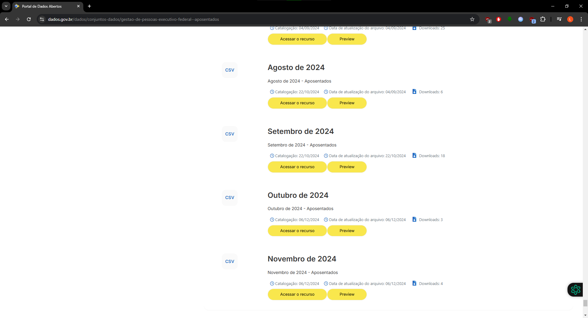
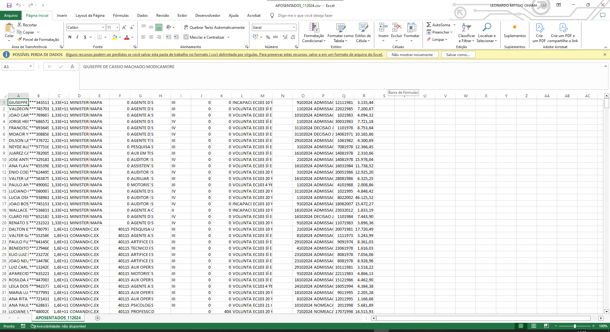
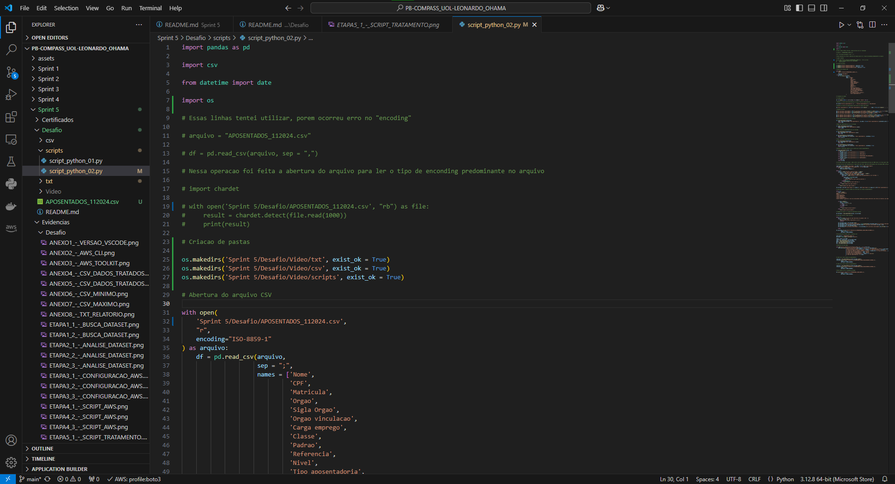
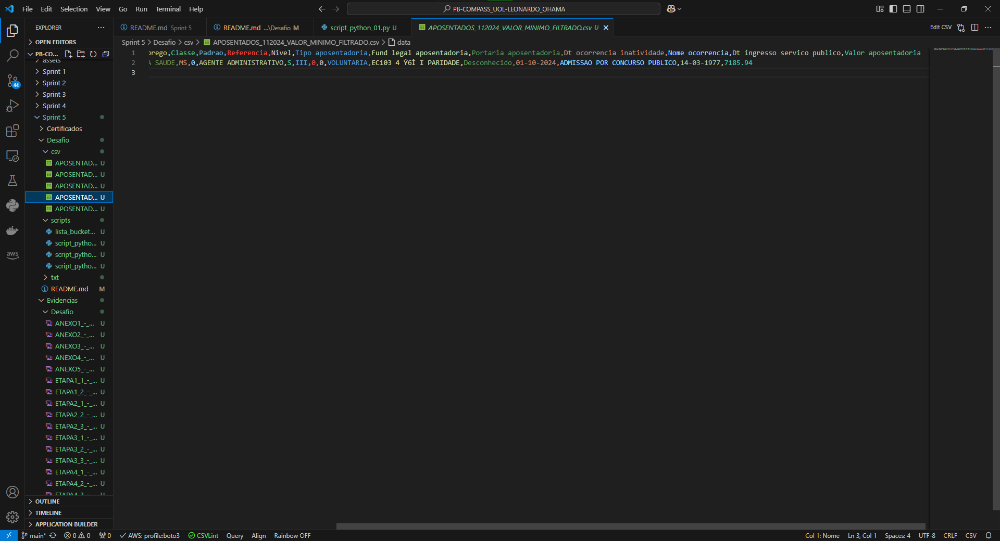

# Sumário

### Desafio:

## Arquivos

1. [CSV Original](csv/APOSENTADOS_112024.csv)

2. [CSV apenas Tratado](csv/APOSENTADOS_112024_NOVO.csv)

3. [CSV Filtrado e Tratado](csv/APOSENTADOS_112024_NOVO_FILTRADO.csv)

4. [CSV Somente com o Valor Mínimo](csv/APOSENTADOS_112024_VALOR_MINIMO_FILTRADO.csv)

5. [CSV Somente com o Valor Máximo](csv/APOSENTADOS_112024_VALOR_MAXIMO_FILTRADO.csv)

6. [Script Python AWS Criação Bucket e Upload do arquivo](scripts/script_python_01.py)

7. [Script Python Processamento de dados](scripts/script_python_02.py)

8. [txt com alguns dados do CSV](txt/relatorio_dados.txt)

9. [txt com a lista das siglas de Orgaos do Governo para o auxílio nos inputs](txt/lista_siglas.txt)

## Etapas

1. [Etapas](#etapas)

    I.    [Etapa 1 - Procura e download da base de dados](#Etapa1)

    II.   [Etapa 2 - Análise de dados](#Etapa2)

    III.  [Etapa 3 - Configuração da conta AWS no VSCode](#Etapa3)

    IV.   [Etapa 4 - Primeiro script AWS](#Etapa4)

    V.    [Etapa 5 - Segundo script para o tratamento de dados e novos arquivos](#Etapa5)

    VI.   [Etapa 6 - Segundo script para a criação de arquivos](#Etapa6)

    VII.  [Etapa 7 - Segundo script para a criação de arquivos 2](#Etapa7)

    VIII. [Etapa 8 - Primeiro script continuação AWS](#Etapa8)

2. [Anexos](#anexos)

    I.    [Anexo 1 - Versão VSCode](#Anexo1)

    II.   [Anexo 2 - Versão AWS CLI e Python](#Anexo2)

    III.  [Anexo 3 - Versão Extensão AWS Toolkit](#Anexo3)

    IV.   [Anexo 4 - CSV Dados Tratados](#Anexo4)

    V.    [Anexo 5 - CSV Dados Tratados e Filtrados](#Anexo5)

    VI.   [Anexo 6 - CSV Mínimo](#Anexo6)

    VII.  [Anexo 7 - CSV Máximo](#Anexo7)

    VIII. [Anexo 8 - txt Relatório](#Anexo8)

### README:

1. [README Principal](../../README.md)

2. [README Sprint 5](../README.md)

# Etapas

Explicação do desenvolvimento de programas em Python, o primeiro script tem que conter a criação de um bucket na AWS S3 e os uploads de todos os arquivos e o segundo script é para tratar os dados e responder "Quais serão as linhas geradas no dataset que contém os Orgãos INSS ou MS (Ministério da Saúde), têm os valores de aposentadoria acima de 7000 reais, contando com todos os tipos de aposentadoria e até o dia 15? E quais serão as linhas geradas de seu valor máximo e mínimo?". Para o desenvolvimento foi utilizado o VSCode Version 1.96.2 (Release Date 19/12/2024), AWS CLI 2.22.19, Python 3.12.6 e AWS Toolkit 3.40.0, para mais informações: [Anexo 1 - Versão VSCode](#Anexo1), [Anexo 2 - Versão AWS CLI e Python](#Anexo2), [Anexo 3 - Versão Extensão AWS Toolkit](#Anexo3).

1. ... [Etapa 1 - Procura e download da base de dados](#Etapa1)

    Primeiramente entra-se no site https://dados.gov.br/ e depois procura-se "aposentados", para esse caso é selecionado o "Gestão de Pessoas (Executivo Federal) – Aposentados" e logo após é aberto a aba "Recursos" que contém os dados desde Novembro 2016, mas para a análise foi selecionado o último CSV enviado que se refere a Novembro de 2024.

    

    

[**Voltar ao Sumário**](#sumário)

2. ... [Etapa 2 - Análise de Dados](#Etapa2)

    Com a base da dados selecionada, é possível perceber que não há nome das colunas no csv para isso precisa-se inserir o nome das colunas para melhor entendimento do dataset. 

    

    Pelos dataset anteriores foi possível encontrar um dataset que há todos os nomes da colunas que serão inseridas posteriormente no Python.

    

    Inicialmente é visto uma coluna em branco em sua maioria e pelo dataset que têm o nome das colunas, essa coluna corresponde a "Portaria aposentadoria", a utilizacao de datas no formato DDMMAAAA, DMMAAAA e por último os centavos utilizados no valor da moeda é utilizado a vírgula em vez do ponto.

    

[**Voltar ao Sumário**](#sumário)

3. ... [Etapa 3 - Construção do primeiro script da AWS](#Etapa3)

    Antes da criação do script primeiro foi feito o download do programa AWS CLI para a configuração e utilizado o comando no terminal "aws sso config" que pede as credenciais e depois de configurado é criado o arquivo config seguinte:

    

    Para o VSCode é instalado a extensão "AWS Toolkit" que irá auxiliar na parte das credenciais e na manipulação dos serviços da AWS.

    

    Depois da configuração e feito o login com o comando no terminal cmd e o comando "aws sso login --profile boto3" é aberto uma janela no navegador para o login e depois disso é utilizado o CTRL+SHIFT+P no VSCode e selecionado "AWS: Connect AWS" e selecionado o profile que nesse caso é o boto3.

    

[**Voltar ao Sumário**](#sumário)

4. ... [Etapa 4 - Primeiro script AWS](#Etapa4)

    Primeiro é feito o download no terminal com o pip install boto3 e agora no script é utilizado o import boto3 e depois é criado duas variáveis, a primeira é relativo a especificação certa do profile, porque se não é utilizado o "default" e depois na segunda variável é criado o client no s3. Logo após, é criado uma variável para o nome do bucket que vai ser criado, em seguida duas variáveis, uma para o caminho do arquivo que vai ter o upload e o outro é o nome do arquivo. Em seguida, é criado um bloco de try para a criação do bucket, upload do dataset e o download do dataset.

    

    

    

[**Voltar ao Sumário**](#sumário)

5. ... [Etapa 5 - Segundo script para o tratamento de dados](#Etapa5)

    No segundo script primeiro é importado as bibliotecas que serão utilizadas e quando foi feito na primeira vez, primeiro foi identificado (com as linhas de comando em comentários) que o arquivo estava com uma difícil manipulação de dados devido ao erro do "Enconding" do arquivo e para isso foi necessário abrir o arquivo com o Enconding predominante que é o "ISO-8859-1" e como é mostrado no print em seguida foram criadas o nome das colunas.

    

    Depois disso, foi retirado todos espaços em branco nas extremidades das linhas com o auxílio da função lambda e o strip() para as linhas que precisam ser feitas esse tratamento, agora para a coluna que estava em sua maior parte em "branco", que é da coluna "Portaria aposentadoria" foi colocado nesses valores em "branco" o valor "Desconhecido". Na linha de comando seguinte é tratado os valores referente a coluna "Valor aposentadoria" que primeiro tinha ponto para indicar valores a cada 1000 e os centavos que estavam representados pela vírgula e para isso foram feitas a utilização de tranformação para string (.str) e o replace para retirar esses valores de . e de vírgula, sendo o último para a substituição com o ponto e no final transformando os valores da coluna em float. E finalizando a etapa de tratamento é feito a mudança nas datas que estavam em um formato não adequado e para isso, primeiro é verificado se as datas estão no formato DDMMAAAA ou se estão no formato incorreto que seria o DMMAAAA, como os valores que representam esse formato incorreto é devido os programas ignorarem o zero a esquerda por entenderem que é um número inteiro, assim foi utilizado a função lambda para verificar cada linha das colunas: "Dt ocorrencia inatividade" e "Dt ingresso servico publico" e nas linhas de comando seguintes é transformado os valores da coluna em datetime e com o formato DD-MM-AAAA.

    

[**Voltar ao Sumário**](#sumário)

6. ... [Etapa 6 - Segundo script para a criação de arquivos](#Etapa6)

    Para esta etapa é criado funções que: 
    1ª Função - irá retornar o total de valores da coluna "Valor aposentadoria", porém o agrupamento é feito pelo o "Tipo da aposentadoria";
    2ª Função - a média dos valores da aposentadoria pela coluna "Valor aposentadoria";
    3ª e 4ª Função - na terceira função o valor máximo da coluna "Valor aposentadoria" e na quarta função a linha inteira que contêm esse valor máximo;
    5ª e 6ª Função - na quinta função o valor mínimo da coluna "Valor aposentadoria" e na sexta função a linha inteira que contêm esse valor mínimo;
    7ª Função - nessa função retorna qual o tipo de aposentadoria deve retornar o dataframe.

    

[**Voltar ao Sumário**](#sumário)

7. ... [Etapa 7 - Segundo script para a criação de arquivos 2](#Etapa7)

    Para a análise de dados a pergunta que será utilizada para gerar o CSV final é: "Quais serão as linhas geradas no dataset que contém os Orgãos INSS ou MS (Ministério da Saúde), têm os valores de aposentadoria acima de 7000 reais, contando com todos os tipos de aposentadoria e até o dia 15? E quais serão as linhas geradas de seu valor máximo e mínimo?".
    Com isso, primeiro é gerado um arquivo txt que contém todos as siglas dos Orgãos e logo após, é criado um loop que vai receber um input do usuário e já transformando os caracteres em maiúsculas e só irão receber se o input tiver dentro dos valores da coluna "Sigla orgao", para o segundo input é feito novamente isso e no terceiro input é recebido o valor mínimo numérico que o usuário quer filtrar e se caso essas restrições não sejam atingidas, irá retornar erros como: valor não positivo ou o usuário colocando valores não numéricos etc. Após esses inputs é gerado um dataframe filtrando todos esses valores estabelecidos pelo usuário. Os valores do input vão ser: "INSS > MS > 7000". [Lista Siglas](txt/lista_siglas.txt)

    

    No loop seguinte é filtrado os valores pelos tipos de aposentadoria que para esse caso é "0", depois do loop é criado o novo dataframe.

    

    Para o último loop é realizado o filtro das datas que para esse caso é dia 01 a 15, no programa é recebido o input do usuário, transformado em inteiro e comparado se é um valor válido com if e depois é feita uma cópia do dataframe para evitar erros no dataframe original e é transformado novamente o valor da coluna em datetime, porque quando se utiliza strftime ele muda o formato dessa coluna,logo após é filtrado até a data do input e finalmente é colocado no formato DD-MM-AAAA. E assim, no comando seguinte é gerado o csv com a função to_csv() e o arquivo será chamado "APOSENTADOS_112024_NOVO_FILTRADO.csv".

    

    Agora caminhando para a geração final dos arquivos, é feito um arquivo txt que vai conter a data no dia que for gerado o arquivo, a quantidade de linhas e colunas do arquivo original e filtrado, a somatória total, média, máxima e o mínimo da aposentadoria, utilizando todas as funções anteriores criadas.
    Na linha seguinte é criado um csv contendo a linha com o valor máximo de aposentadoria e outro csv com o mínimo de aposentadoria e por último o csv do arquivo somente tratado sem ter os filtros realizados com o input.

    

    

    E os resultados foram:

    [CSV Dados Tratados - Imagem](#Anexo4)

    [CSV Dados Tratados - Arquivo](csv/APOSENTADOS_112024_NOVO.csv)

    [CSV Dados Tratados e Filtrados- Imagem](#Anexo5)

    [CSV Dados Tratados e Filtrados - Arquivo](csv/APOSENTADOS_112024_NOVO_FILTRADO.csv)

    [CSV Mínimo - Imagem](#Anexo6)

    [CSV Mínimo - Arquivo](csv/APOSENTADOS_112024_VALOR_MINIMO_FILTRADO.csv)

    [CSV Máximo - Imagem](#Anexo7)

    [CSV Máximo - Arquivo](csv/APOSENTADOS_112024_VALOR_MAXIMO_FILTRADO.csv)

    [txt Relatório - Imagem](#Anexo8)

    [txt Relatório - Arquivo](txt/relatorio_dados.txt)

[**Voltar ao Sumário**](#sumário)

8. ... [Etapa 8 - Primeiro script continuação AWS](#Etapa8)

    Depois de gerado todos os arquivos é necessário guardar todos os arquivos em um bucket S3 da AWS e para isso vai ser utilizado a segunda parte do primeiro script que irá só fazer os uploads.
    Primeiro é criado as variáveis com os caminhos do diretório dos arquivos e depois nomeado os arquivos que serão inseridos no bucket. E com o auxílio da função upload_file(). 

    

    

        

[**Voltar ao Sumário**](#sumário)

## Anexos

1. ... [Anexo 1 - Versão VSCode](#Anexo1)

    

[**Voltar para Etapas**](#Etapas)

[**Voltar ao Sumário**](#sumário)

2. ... [Anexo 2 - Versão AWS CLI e Python](#Anexo2)

    

[**Voltar para Etapas**](#Etapas)

[**Voltar ao Sumário**](#sumário)

3. ... [Anexo 3 - Versão Extensão AWS Toolkit](#Anexo3)

    

[**Voltar para Etapas**](#Etapas)

[**Voltar ao Sumário**](#sumário)

4. ... [Anexo 4 - CSV Dados Tratados](#Anexo4)

    

[**Voltar para Etapa 7**](#Etapa7_1)

[**Voltar para Etapas**](#Etapas)

[**Voltar ao Sumário**](#sumário)

5. ... [Anexo 5 - CSV Dados Tratados e Filtrados](#Anexo5)

    

[**Voltar para Etapa 7**](#Etapa7_1)

[**Voltar para Etapas**](#Etapas)

[**Voltar ao Sumário**](#sumário)

6. ... [Anexo 6 - CSV Mínimo](#Anexo6)

    

[**Voltar para Etapa 7**](#Etapa7_1)

[**Voltar para Etapas**](#Etapas)

[**Voltar ao Sumário**](#sumário)

7. ... [Anexo 7 - CSV Máximo](#Anexo7)

    

[**Voltar para Etapa 7**](#Etapa7_1)

[**Voltar para Etapas**](#Etapas)

[**Voltar ao Sumário**](#sumário)

8. ... [Anexo 8 - txt Relatório](#Anexo8)

    

[**Voltar para Etapa 7**](#Etapa7_1)

[**Voltar para Etapas**](#Etapas)

[**Voltar ao Sumário**](#sumário)
