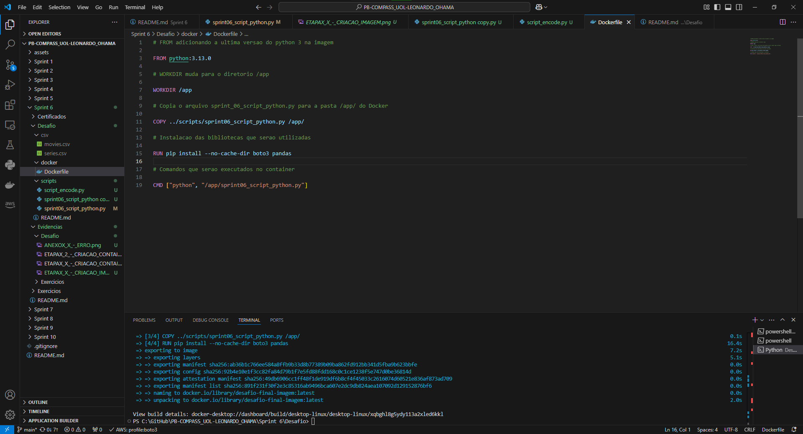

# Sumário

### Desafio:

1. [Dockerfile](docker/Dockerfile)

2. [Script Python](scripts/sprint06_script_python.py)

3. [Script Python Auxiliar](scripts/script_encode.py)

4. [Comandos utilizados no terminal para a manipulação do Docker](<comandos_docker.txt>)

1. [Etapas](#etapas)

    I.    [Etapa 1 - Verificação do datasets e perguntas](#Etapa1)

    II.   [Etapa 2 - Criação do script Python](#Etapa2)

    III.  [Etapa 3 - Criação Dockerfile](#Etapa3)

    IV.   [Etapa 4 - Criação de imagem e um conteiner temporário para a criação de um volume](#Etapa4)

    V.    [Etapa 5 - Criação do conteiner, criação do bucket e upload dos arquivos CSVs](#Etapa4)

    VI.   [Observações](#Observacoes)

2. [Anexos](#anexos)

    I.    [Anexo 1 - Versão VSCode](#Anexo1)

    II.   [Anexo 2 - Versão extensão Docker VSCode](#Anexo2)

    III.  [Anexo 3 - Versão Docker](#Anexo3)

    IV.   [Anexo 4 - Versão WSL](#Anexo4)

### README:

1. [README Principal](../../README.md)

2. [README Sprint 6](../README.md)

# Etapas

Explicação do desenvolvimento de a criação de um conteiner para execução de um script Python que vai fazer um bucket na S3 da AWS e fazer o upload de arquivos CSVs. Para o desenvolvimento foi utilizado o VSCode Version 1.96.2 (Release Date 19/12/2024), Docker extensão para o VSCODE v1.29.3, Docker Desktop Version 4.37.1 (178610), Python Version 3.13.0 (Container), WSL 2, para mais informações: [Anexo 1 - Versão VSCode](#Anexo1), [Anexo 2 - Versão extensão Docker VSCode](#Anexo2), [Anexo 3 - Versão Docker](#Anexo3) e [Anexo 4 - Versão WSL](#Anexo4). 

1. ... [Etapa 1 - Verificação do datasets e perguntas](#Etapa1)

    Primeiramente é analisado os datasets que incluem os arquivos CSV de filmes e séries, com isso é necessário fazer algumas perguntas que serão respondidas ao final do Programa de Bolsas, no meu caso sou da Squad 6 que vai incluir somente os gêneros de Mistério e Terror. Portanto as perguntas serão as seguintes:

    1) As bilheterias totais dos filmes do gênero terror e mistério de cada ano. Os filmes desses gêneros têm sido têndencia nos últimos anos? Justifique plotando os gráficos.

    2) Comparar os filmes Psycho (Psicose), The Shining (O Iluminado), The Exorcist (O Exorcista) e Scream (Pânico) com os filmes do mesmo gênero em seu respectivo ano. Esses filmes foram os mais rentáveis de seu ano em seus respectivos gêneros?(Gráficos Orçamento X Receita e % de rentabilidade).

    3) Agora compare entre os filmes da questão 2.

    4) Os filmes do ano 1999 do gênero Terror que têm as melhores avaliações obtiveram a melhor rentabilidade de seu ano?

    5) Liste os 10 diretores que obtiveram mais bilheteria entre os anos 2015 a 2019.

    6) O impacto da popularização do streaming afetou a bilheteria? Considere que streamings como Netflix começou a ficar popular em 2016, ou seja, comparar os dados de bilheterias de antes dessa data com a de depois dessa data.

[**Voltar ao Sumário**](#sumário)

2. ... [Etapa 2 - Criação do script Python](#Etapa2)

    Para a criação do script, primeiro é importado as bibliotecas pandas, boto3 e datetime que serão utilizadas posteriormente. Após isso, é verificado o encoding predominante em cada dataset para evitar erros de leitura para isso foram lidas as primeiras 5000 bytes de cada dataset e com isso o resultado foi que o encoding predominante é UTF-8.
    
    

    Foi criado um segundo código Python para verificar se é possível realizar a leitura do CSV com apenas colocando os delimitadores dos datasets como | e o encoding de UTF-8, porém é observado que não é possível e para isso no código final do Python foi colocado a opção de low_memory como False e o tipo de coluna de string na coluna 3. Obs.: No código principal já foi colocado o código final de leitura. A maior diferença vai ser no diretório que no código auxiliar é feito no "local" e do código final é no diretório do conteiner que será criado depois.

    

    Executando o código novamente, é possível ver que não ocorreu erro, assim a leitura do CSV foi bem sucedida.

    

    Agora é criado variáveis de data que serão utilizadas para a nomeação das pastas no Datalake, nome do bucket e os diretórios que serão utilizados dentro do conteiner e o diretório que será alocado no bucket S3.

    

    E finalmente é feito a criação do bucket e do upload dos arquivos CSVs.

    

[**Voltar ao Sumário**](#sumário)

3. ... [Etapa 3 - Criação Dockerfile](#Etapa3)

    No Dockerfile primeiro é definido a versão do Python que será utilizada na imagem que nesse caso é o 3.13.0 pelo comando FROM, no WORKDIR é para mudar para o diretório /app/, em seguida é copiado o script Python feito anteriormente e em seguida é utilizado o RUN com o pip install para instalar dentro do conteiner as bibliotecas utilizadas no script Python que nesse caso é boto3 e o pandas. Finalizando o arquivo Dockerfile é executado os comandos do script Python pelo comando CMD.

    

[**Voltar ao Sumário**](#sumário)

4. ... [Etapa 4 - Criação de imagem e um conteiner temporário para a criação de um volume](#Etapa4)

    Primeiro é mudado o diretório de execução no terminal com o comando 'cd Sprint 6/Desafio"' que é a pasta "raiz" do Desafio e logo em seguida é utilizado o comando no terminal "docker build -f "docker/Dockerfile" -t desafio-final-imagem ." para a criação da imagem "desafio-final-imagem" utilizando o Dockerfile da pasta docker.

    

    Para a criação de um volume no Docker é feito um conteiner temporário para somente a criação do volume que será utilizado para os conteiners futuros. Esse conteiner é nomeado como temp e o volume é chamado de datasets na pasta data/ e é utilizado o busybox para uma melhor eficiência da imagem do conteiner.

    

    

[**Voltar ao Sumário**](#sumário)

5. ... [Etapa 5 - Criação do conteiner, criação do bucket e upload dos arquivos CSVs](#Etapa5)

    Nesta etapa é criado o conteiner e o bucket no S3. Para isso é utilizado o volume criado anteriormente pelo conteiner temporário com o comando -v datasets:/data desafio-final-imagem e também é utilizado um bind mount para utilizar as credenciais da aws, ou seja, colocando as credenciais dentro do conteiner na pasta "root/.aws" com o comando '-v "C:\Users\Installer\.aws:/root/.aws"' e o "comando docker run -d --name desafio-final-conteiner" para criar um conteiner com o nome "desafio-final-conteiner", assim o comando inteiro executado é (é utilizado o ` para fazer quebra de linha e ficar mais legível):
        docker run -d --name desafio-final-conteiner `
    -v "C:\Users\Installer\.aws:/root/.aws" `
    -v datasets:/data desafio-final-imagem

    

    Pelo log do Docker é possível verificar que a operação foi bem sucedida.

    

    E no final ao visitar o console da AWS é possível verificar os arquivos CSVs estão alocados no bucket criado.

    

    

[**Voltar ao Sumário**](#sumário)

6. ... [Observações](#Observacoes)

    I. Possivelmente algumas perguntas feitas para o desafio final irão sofrer algumas alterações ao decorrer do Programa de Bolsas.

    II. Para utilizar o script no conteiner do Docker com o profile é necessário que faça o login no VSCode com o profile, se não irá ocorrer um erro ao fazer o bucket e o upload.

    III. Quando for executar o script é necessário colocar os dois CSVs (movies e series) na pasta "Sprint 6/Desafio/csv", porque não foi possível colocar no GitHub devido ao tamanho dos arquivos.

[**Voltar ao Sumário**](#sumário)

## Anexos

1. ... [Anexo 1 - Versão VSCode](#Anexo1)

    

[**Voltar para Etapas**](#Etapas)

[**Voltar ao Sumário**](#sumário)

2. ... [Anexo 2 - Versão extensão Docker VSCode](#Anexo2)

    

[**Voltar para Etapas**](#Etapas)

[**Voltar ao Sumário**](#sumário)

3. ... [Anexo 3 - Versão Docker](#Anexo3)

    

[**Voltar para Etapas**](#Etapas)

[**Voltar ao Sumário**](#sumário)

4. ... [Anexo 4 - Versão WSL](#Anexo4)

    

[**Voltar para Etapas**](#Etapas)

[**Voltar ao Sumário**](#sumário)
