# Sumário

### Desafio:

1. [Dockerfile](docker/Dockerfile)

2. [Script Python](scripts/tmdb_request_api.py)

3. [Script Python Auxiliar](scripts/verificacao_filmes.py)

4. [movies JSON 1](<json/movies_1.json>)

5. [movies JSON 2](<json/movies_2.json>)

6. [movies JSON 3](<json/movies_3.json>)

7. [movies JSON 4](<json/movies_4.json>)

8. [movies JSON 5](<json/movies_5.json>)

9. [movies JSON 6](<json/movies_6.json>)

10. [movies JSON 7](<json/movies_7.json>)

11. [movies JSON 8](<json/movies_8.json>)

12. [movies JSON 9](<json/movies_9.json>)

13. [movies JSON 10](<json/movies_10.json>)

14. [movies JSON 11](<json/movies_11.json>)

15. [movies JSON 12](<json/movies_12.json>)

1. [Etapas](#etapas)

    I.    [Etapa 1 - Explorando endpoints do TMDB](#Etapa1)

    II.   [Etapa 2 - Criação do script Python - Bibliotecas e variáveis iniciais](#Etapa2)

    III.  [Etapa 3 - Criação do script Python - Loop](#Etapa3)

    IV.   [Etapa 4 - Criação do script Python - Finalização do script](#Etapa4)

    V.    [Etapa 5 - Dockerfile, biblioteca requests](#Etapa5)

    VI.   [Etapa 6 - Lambda e execução do script](#Etapa6)
    
    VII.  [Observações](#Observacoes)

2. [Anexos](#anexos)

    I.    [Anexo 1 - Versão VSCode](#Anexo1)

    II.   [Anexo 2 - Versão extensão Docker VSCode](#Anexo2)

    III.  [Anexo 3 - Versão Docker](#Anexo3)

    IV.   [Anexo 4 - Versão WSL](#Anexo4)

### README:

1. [README Principal](../../README.md)

2. [README Sprint 7](../README.md)

# Etapas

Explicação do desenvolvimento da extração dos dados dos filmes pela API TMDB. Para o desenvolvimento foi utilizado o VSCode Version 1.96.4 (Release Date 16/01/2025), Docker extensão para o VSCODE v1.29.3, Docker Desktop Version 4.37.1 (178610), Python Version 3.9.0 (Container), WSL 2, para mais informações: [Anexo 1 - Versão VSCode](#Anexo1), [Anexo 2 - Versão extensão Docker VSCode](#Anexo2), [Anexo 3 - Versão Docker](#Anexo3) e [Anexo 4 - Versão WSL](#Anexo4). 

1. ... [Etapa 1 - Explorando endpoints do TMDB](#Etapa1)

    Primeiramente é analisado os endpoints da API do TMDB, assim é acessado o endpoint do discover/movie que é possível realizar filtros que irá diminuir o número de registros dos arquivos JSON que serão gerados posteriormente.

    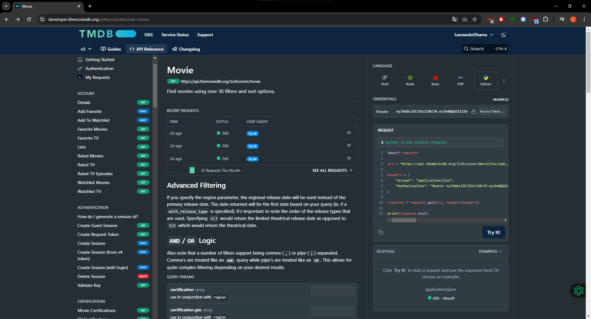

    Agora é feito o filtro que é necessário para uma melhor seleção de dados que serão mais relevantes na análise. Para isso foi utilizado no endpoint os filtros: tirando filmes adultos e vídeos (colocando a clásula FALSE), língua inglesa (esse primeiro filtro é somente para overview, title etc), página 1 (porém no script vai iterar as páginas até chegar a última página), o sort_by que tem pouca relevância, porque irá juntar os arquivos posteriormente na análise, filmes com notas médias acima de 5 e com no mínimo de 300 votos feitos, o gênero 27 que corresponde pelos filmes de gênero Terror (vale ressaltar que foi utilizado genre para procurar o gênero Terror) e a língua falada no filme que é o inglês.

    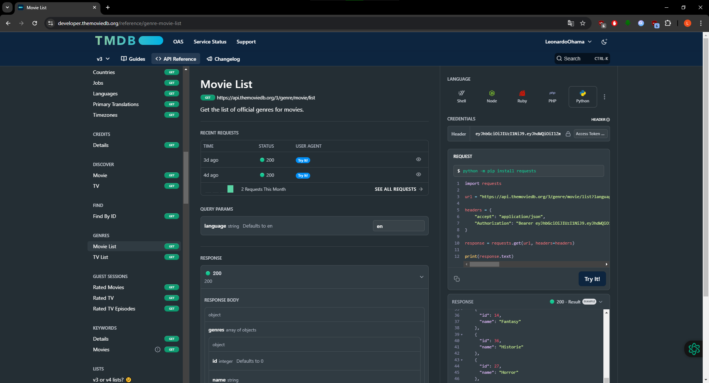

    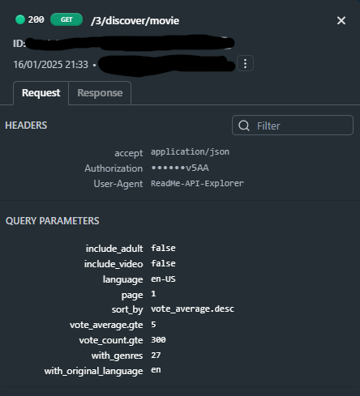

    Pelo endpoint "movie/movie_id" é possível obter a maior parte das informações com exceção do director que é necessário fazer a requisição por outro endpoint que é o credits a partir do movie id do filmes. No exemplo das prints foi utilizado o ID 539 que é do filmes Psycho(Psicose).

    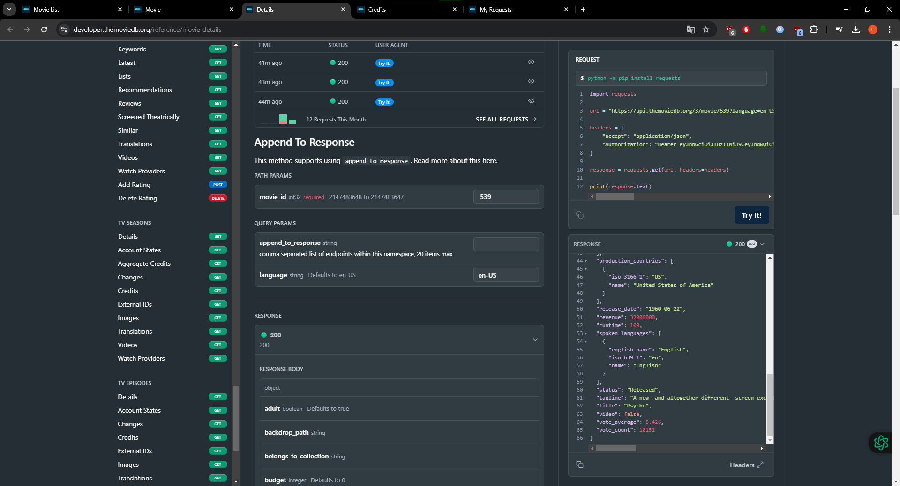

    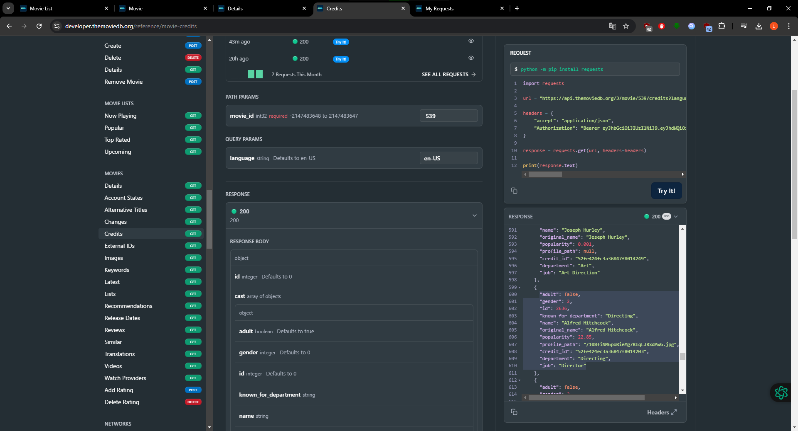

[**Voltar ao Sumário**](#sumário)

2. ... [Etapa 2 - Criação do script Python - Bibliotecas e variáveis iniciais](#Etapa2)

    Determinar os endpoints que serão utilizados, agora é criado o script Python que vai ser responsável para a extração dos dados da API TMDB em arquivos JSON que devem respeitar os 100 registros ou arquivo de até 10 MB em um arquivo JSON.

    No começo do script é primeiro importado as bibliotecas que serão utilizadas que são:
    - requests (responsável para fazer as requisições da API, é necessário lembrar que a biblioteca requests não é nativa do Python, sendo assim necessário utilizar o pip install requests e no caso que vai ser utilizado o Lambda é necessário criar uma layer com essa biblioteca);
    - json (para transformar as informações extraídas em arquivo JSON);
    - date (incluir a data quando for feito o upload dos arquivos JSON);
    - boto3 (manipulação para fazer o upload em um bucket S3);
    - os (utilizado para criar váriaves de ambiente que serão utilizadas, que nesse caso é o api_key da API do TMDB).

    Após a importação das bibliotecas é definido a função lambda e dentro desta função é primeiro criado uma váriavel que é responsável pela api_key do TMDB e para isso é criado como uma variável de ambiente para a melhor segurança do código e depois é definido a url "base" que será utilizado por todos os endpoints.

    Agora as variáveis que serão criadas são para o controle do script, primeiro é feito o max_file_size que limita o arquivo para 10 MB que nesse caso está em bytes e com no máximo de registros pela variável max_records. Na variável movies_details_json é uma lista que irá guardar os dados dos filmes, size_json é uma variável que vai verificar o tamanho do arquivo JSON, page que será responsável pelo controle da página do TMDB, o index que irá colocar o índice do nome do arquivo e o total_records que vai verificar o número de filmes gerados.

    Depois é feitos as variáveis de data que será utilizado para criar os diretórios no bucket e o s3 que é uma variável responsável para fazer a manipulação do bucket, o bucket_name que será o bucket aonde será salvo os arquivos JSON e o json_movies que é o diretório que será gravado os arquivos JSON.
    
    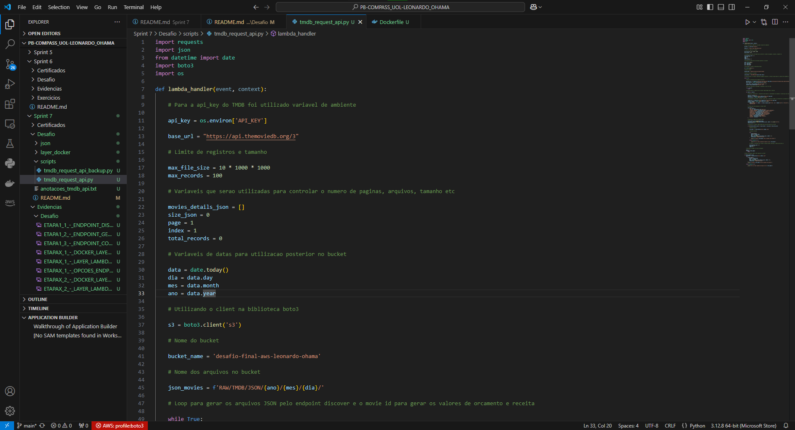

[**Voltar ao Sumário**](#sumário)

3. ... [Etapa 3 - Criação do script Python - Loop](#Etapa3)

    No loop do arquivo que vai ser processado os dados dos filmes, primeiro é criado uma variável discover_url que utiliza a url base criada anteriormente, api_key do TMDB e a página com os filtros do endpoint discover. E em seguida, a variável data_response que vai fazer uma requisição GET por essa url e coloca em um formato do tipo dicionário, por exemplo e logo após, é pego o número total de páginas pelo total_pages e results que pega os resultados feita pela requisição. Depois disso é criado uma condição que sai do loop quando não há mais resultados pela requisição. Agora no próximo laço começa o processamento das infomações dos filmes primeiro é pego o movie_id do filme, no movie_url é o endpoint movie que irá processar pelo ID dos filmes e depois uma requisição por esse endpoint pelo movie_id.

    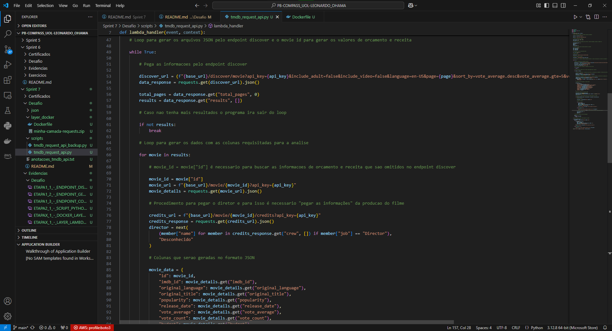

    Para a busca do diretor é necessário pegar as informações dos produtores, diretor etc. Para isso é utilizado o endpoint credits e com isso é feito o request e depois é usado um gerador para encontrar o primeiro valor de "Director" e caso não tenha esse valor a expressão irá colocar o valor como "Desconhecido".

    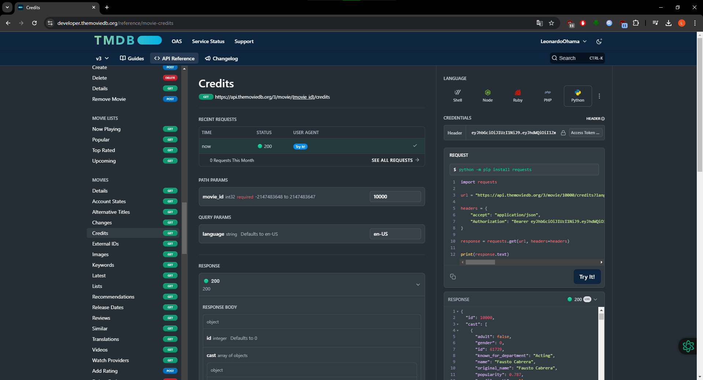

    Agora é um dicionário que vai ser colocado as informações que devem conter para cada filme gerado pelo loop, são elas:
    - "id" é o ID do filme;
    - "imdb_id" é o ID do IMDB que é o utilizado nos arquivos CSV;
    - "original_language" é a língua utilizada no filme;
    - "original_title" é o nome do filme;
    - "popularity" é a popularidade do filme, é importante ressaltar que é um valor volátil e dependente totalmente de época;
    - "release_date" é o data de lançamento do filme;
    - "vote_average" é a votação média pelo público sem a crítica;
    - "vote_count" é o número de votos do público;
    - "budget" é o orçamento do filme;
    - "revenue" é a bilheteria do filme;
    - "director" é o diretor do filme.

    Logo após é feito um append na lista criada no começo do script que vai guardar 100 registros ou 10 MB por arquivo JSON e depois é guardado o tamanho do arquivo para isso é necessário utilizar o json.dumps que "transforma" em JSON para sua verificação com a função len() e é feito a contagem do total de filmes gerados no final do script.

    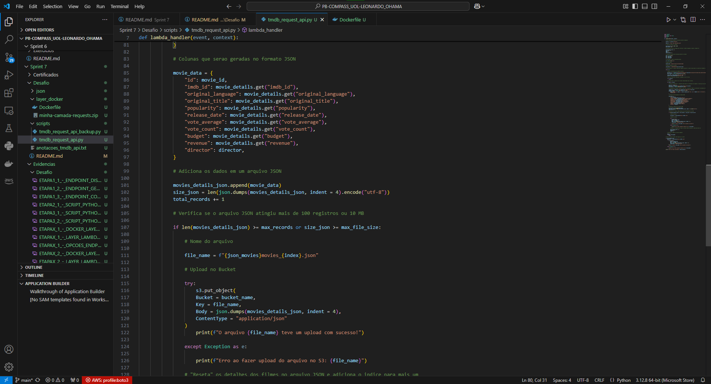

[**Voltar ao Sumário**](#sumário)

4. ... [Etapa 4 - Criação do script Python - Finalização do script](#Etapa4)

    Partindo para o final do script primeiro é primeiro verificado se o dicionário já atingiu o limite de 100 registros ou de 10 MB, caso tenha atingido é criado uma variável para guardar o nome do arquivo gerado, que vai ter o diretório e o nome "movies" com o índice criado anteriomente. Logo após, é criado um try/catch para fazer o upload desse arquivo para isso é utilizado a função put_object que para seu funcionamento precisa ser colocado o nome do bucket, nome do arquivo pelo Key, o que vai conter nesse arquivo pelo body que agora é convertido em JSON e por último que não é obrigatório, mas para melhor interpretação do s3 é colocado o tipo de conteúdo do arquivo como "application/json" e se tudo estiver correto o terminal imprime uma mensagem de sucesso do procedimento. Agora como foi feito o upload desse arquivo é necessário "resetar" alguns valores, como a lista que contém as informações dos filmes, o tamanho do arquivo JSON e o índice que aumenta o valor em uma unidade. Se caso é atingido o final da página que a requisição foi feita ele irá sair do laço for e ir para página seguinte da request com o auxílio da variável page que irá fazer a requisição para a próxima página e fazer todo o procedimento novamente e caso não tenha mais página o laço While irá sair também. No final do script é feito o upload do último arquivo, porque depois de sair dos laços o último arquivo não seria salvo por não ter mais resultados e por último imprime a quantidade de filmes que foram processados.

    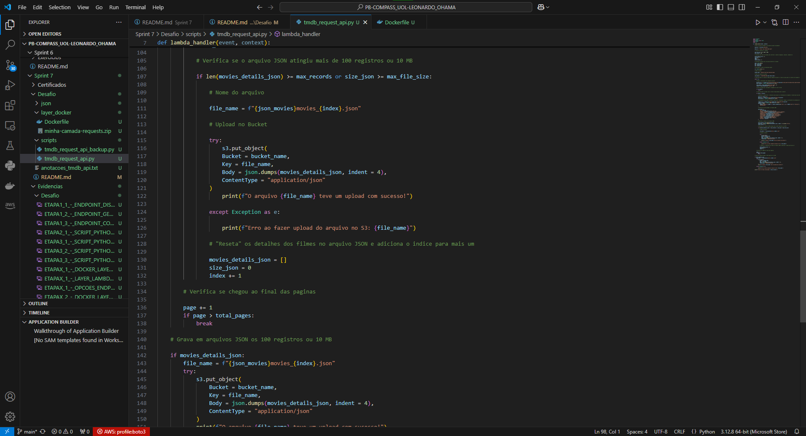

    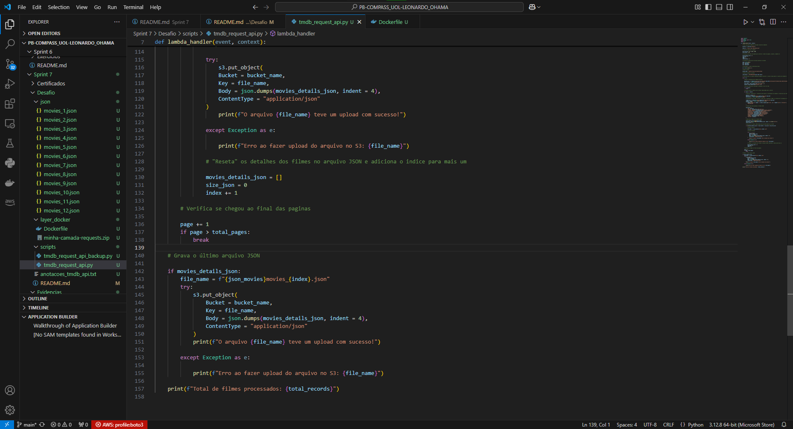

[**Voltar ao Sumário**](#sumário)

5. ... [Etapa 5 - Dockerfile, biblioteca requests](#Etapa5)

    Para utilizar a biblioteca requests é necessário realizar os procedimentos pelo Docker para a criação de uma layer no Lambda que executará o código para isso é criado um Dockerfile para a criação de uma imagem com base no Linux da Amazon 2023, depois de criado a imagem é criado um conteiner que vai ser criado a biblioteca requests dentro da pasta /root/layer_dir/python com o pip install e após isso é compactado e copiado para o sistema local para ser levado a layer do Lambda. 

    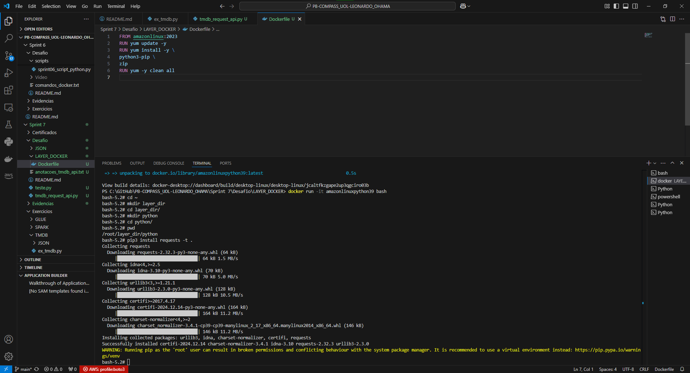

    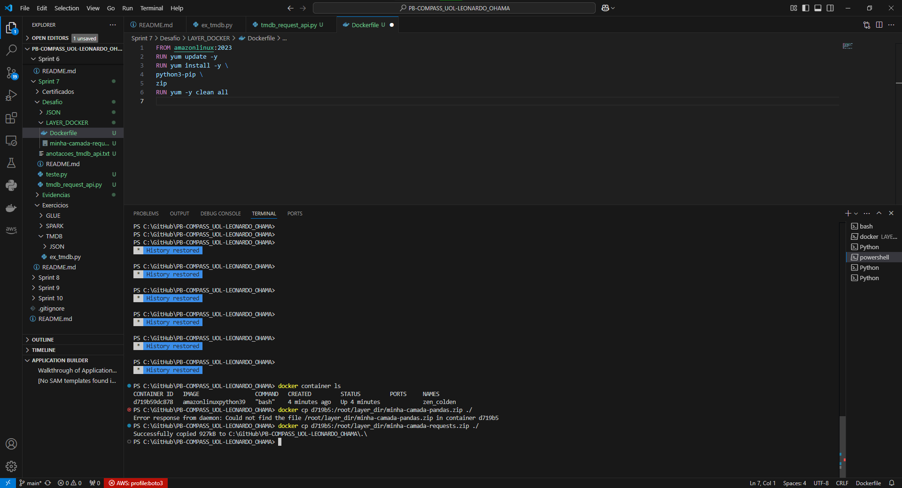

    No console do Lambda é criado a layer chamado RequestsLayer com a opção x86_64 e Python 3.9.

    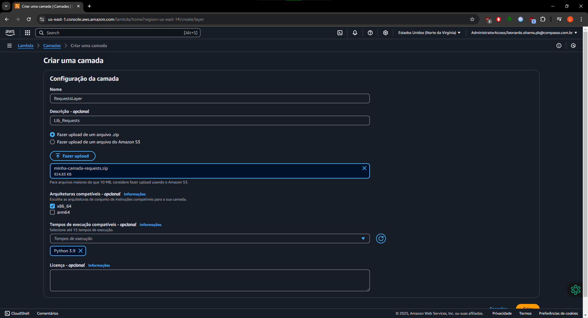

    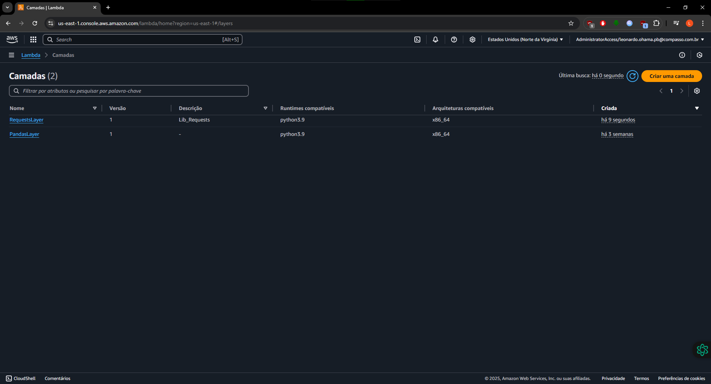

    Na configuração da função Lambda é utilizado as configurações de memória 128 MB, armazenamento de 512 MB e o de timeout de 5 minutos.

    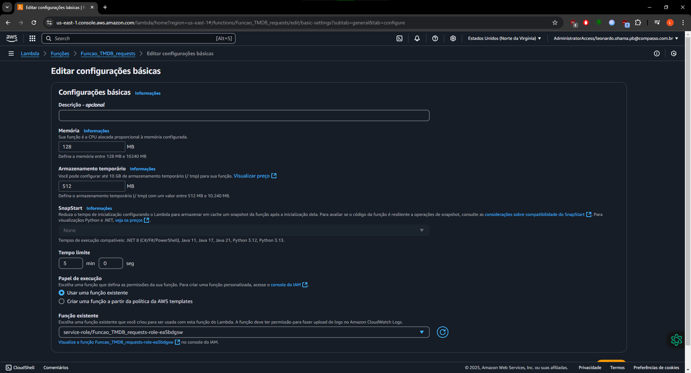

[**Voltar ao Sumário**](#sumário)

6. ... [Etapa 6 - Lambda e execução do script](#Etapa6)

    No console do Lambda é copiado o script Python para execução no Lambda e é configurado variáveis de ambiente e depois é feito o deploy e o test para a execução do script.

    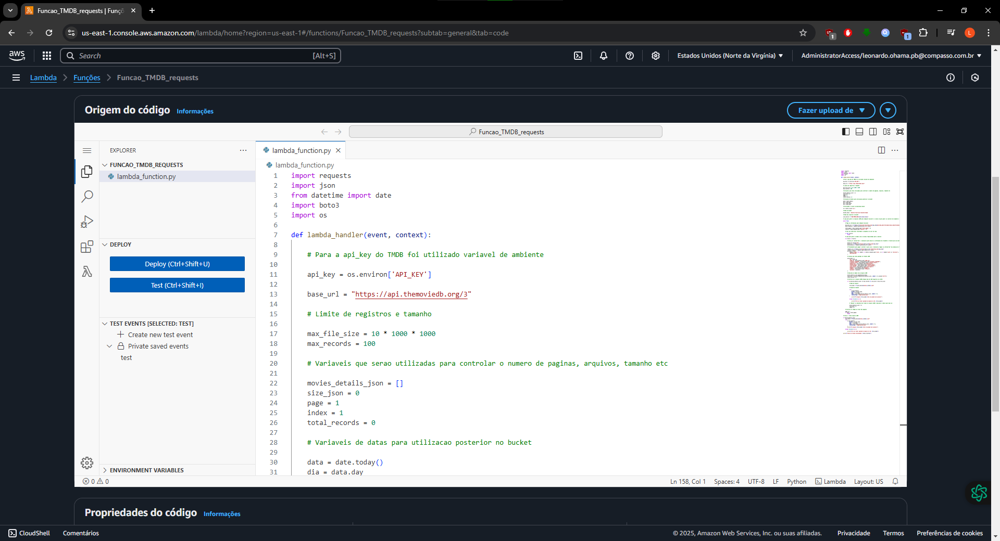

    Após feito o deploy e apertar o botão do test é gerado 12 arquivos JSON com 100 registros cada e que contém informação de 1179 filmes.

    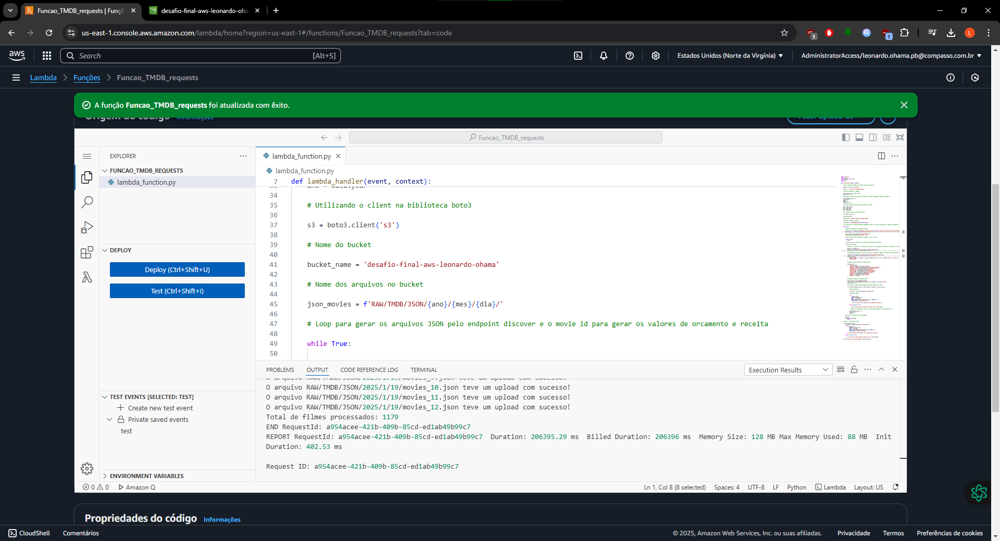

    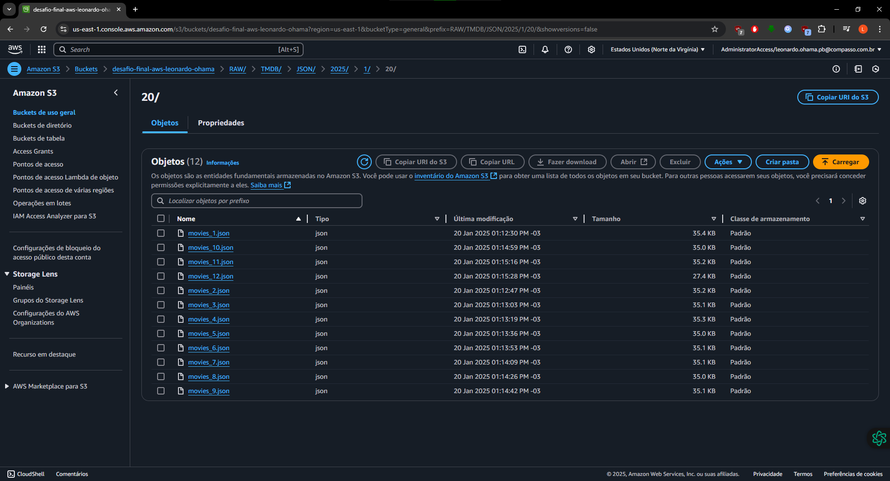

    No final foi feito um script para verificar se os filmes que estão inclusos na Sprint passada estão incluídos nas condições dadas, com isso foi possível ver que todos estão inclusos e pode ter repetição de nome no script, porque ele verifica os nomes e por alguns serem franquias de filmes vão ter o nome repetido.

    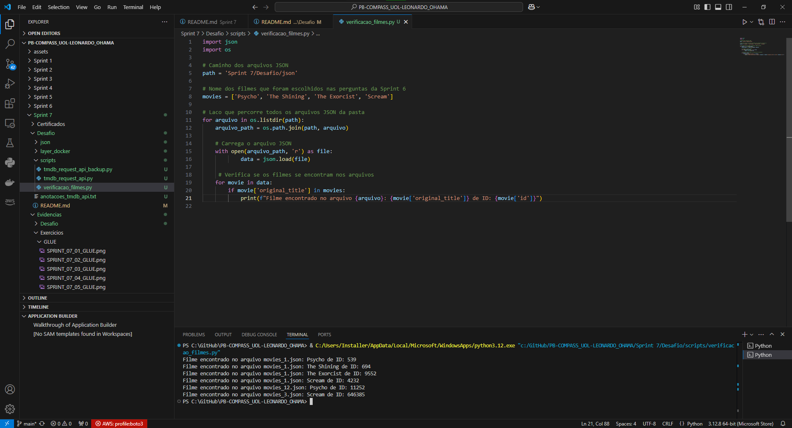

[**Voltar ao Sumário**](#sumário)

6. ... [Observações](#Observacoes)

    I. Possivelmente algumas perguntas feitas para o desafio final irão sofrer algumas alterações ao decorrer do Programa de Bolsas.

    II. Com o segundo script é possível verificar que os arquivos JSON contém os filmes que serão analisados na análise de dados.

    III. Para a análise final vai ser utilizado apenas dados que respeitam os filtros que foram utilizados no endpoint discover que são: no mínimo 300 votos, com a votação média de 5, do gênero Terror e de idioma falado no filme inglês.

[**Voltar ao Sumário**](#sumário)

## Anexos

1. ... [Anexo 1 - Versão VSCode](#Anexo1)

    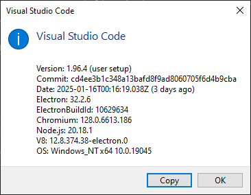

[**Voltar para Etapas**](#Etapas)

[**Voltar ao Sumário**](#sumário)

2. ... [Anexo 2 - Versão extensão Docker VSCode](#Anexo2)

    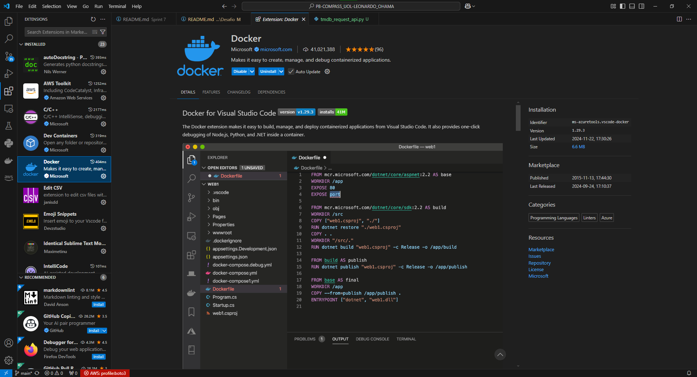

[**Voltar para Etapas**](#Etapas)

[**Voltar ao Sumário**](#sumário)

3. ... [Anexo 3 - Versão Docker](#Anexo3)

    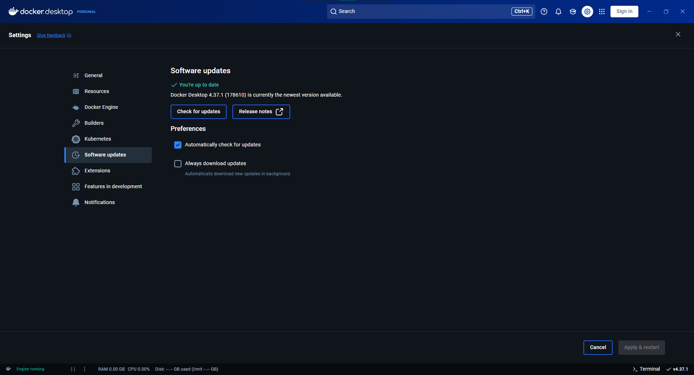

[**Voltar para Etapas**](#Etapas)

[**Voltar ao Sumário**](#sumário)

4. ... [Anexo 4 - Versão WSL](#Anexo4)

    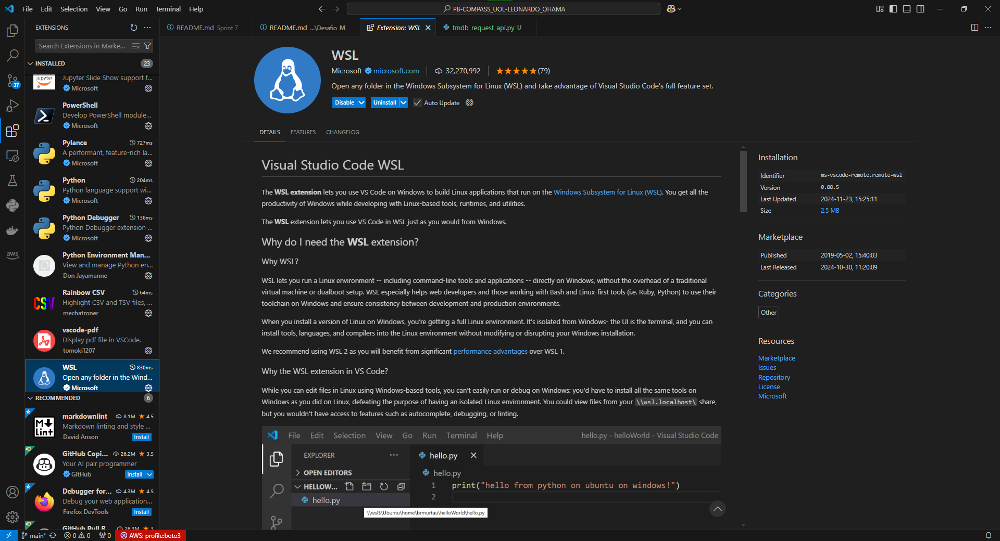

[**Voltar para Etapas**](#Etapas)

[**Voltar ao Sumário**](#sumário)
