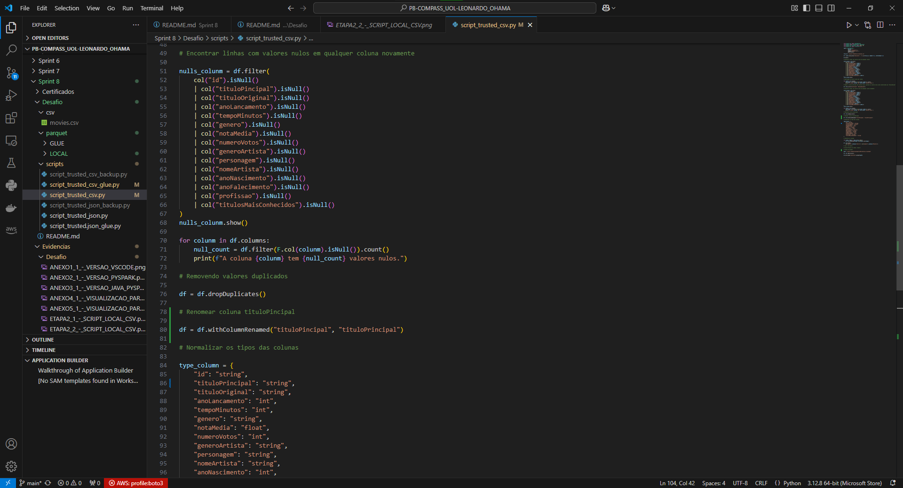
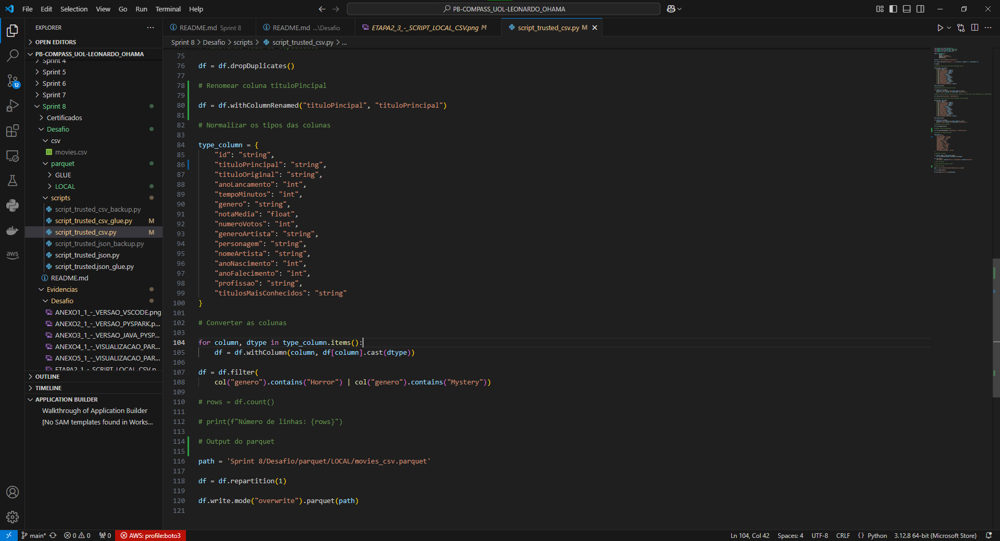
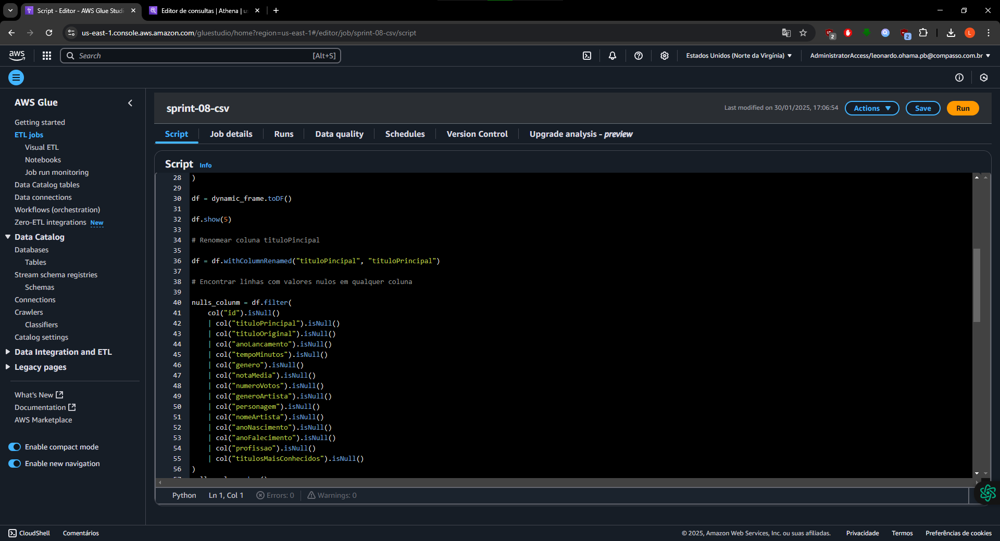
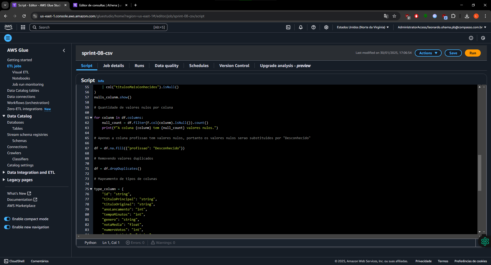
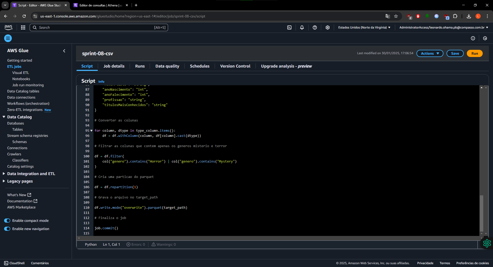
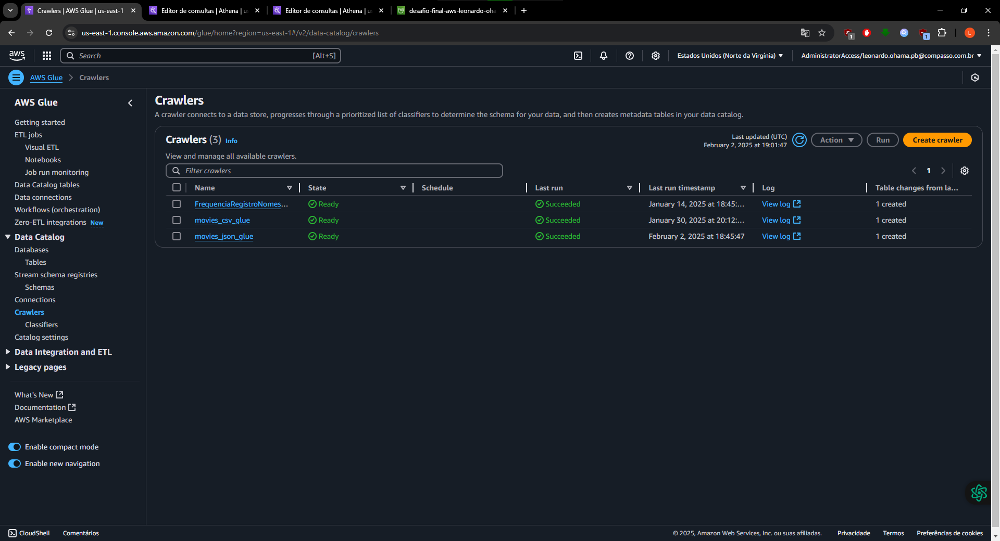

# Sumário

### Desafio:

1. [Script de Python para o Glue para processar o arquivo CSV](scripts/script_trusted_csv_glue.py)

2. [Script de Python para o Glue para processar o arquivo JSON](scripts/script_trusted_json.py)

3. [Script Python Auxiliar Local CSV](scripts/script_trusted_csv.py)

4. [Script Python Auxiliar Local JSON](scripts/script_trusted_json.py)

5. [Arquivo Parquet do Glue (CSV)](parquet/GLUE/part-00000-b766f2e4-a53b-44c6-988f-f50e6ab2c364-c000.snappy.parquet)

6. [Arquivo Parquet do Glue (JSON)](parquet/GLUE/part-00000-74d09563-078f-4d10-ac04-b4953011ffe5-c000.snappy.parquet)

1. [Etapas](#etapas)

    I.    [Etapa 1 - Explicação camada Trusted](#Etapa1)

    II.   [Etapa 2 - Script Python/Pyspark CSV](#Etapa2)

    III.  [Etapa 3 - Script Python/Pyspark JSON](#Etapa3)

    IV.   [Etapa 4 - Criação do Crawler e AWS Athena](#Etapa4)
    
    V.  [Observações](#Observacoes)

2. [Anexos](#anexos)

    I.    [Anexo 1 - Versão VSCode](#Anexo1)

    II.   [Anexo 2 - Versão Pyspark](#Anexo2)

    III.  [Anexo 3 - Versão Java](#Anexo3)

    IV.   [Anexo 4 - Visualização do arquivo Parquet no VSCode (CSV)](#Anexo4)

    V.    [Anexo 5 - Visualização do arquivo Parquet no VSCode (JSON)](#Anexo5)

### README:

1. [README Principal](../../README.md)

2. [README Sprint 8](../README.md)

# Etapas

Explicação do desenvolvimento da extração dos dados dos filmes pela API TMDB. Para o desenvolvimento foi utilizado o VSCode Version 1.96.4 (Release Date 16/01/2025), [winutils - hadoop 3.0 (GitHub de onde o arquivo foi baixado)](https://github.com/steveloughran/winutils/tree/master),Pyspark version 3.5.4, Java version "11.0.25" 2024-10-15  para mais informações: [Anexo 1 - Versão VSCode](#Anexo1), [Anexo 2 - Versão Pyspark](#Anexo2), [Anexo 3 - Versão Java](#Anexo3). 

1. ... [Etapa 1 - Explicação camada Trusted](#Etapa1)

    No processo de transformar os dados da camada RAW para a camada Trusted consiste em fazer uma limpeza dos dados que na camada RAW ainda são dados brutos. Na limpeza vai ser feito o tratamento de dados com valores nulos, duplicados e o tipo de formato das colunas.

    Primeiro para fazer o tratamento de dados foram feitos scripts executados localmente e serão feitos dois jobs que um será para os arquivos JSON da API do TMDB e outro para o CSV.

    No código local foram feitos processos que não foram feitos no AWS Glue, por exemplo, nos arquivos JSON não haviam valores nulos, então as linhas de comando que mostravam esses valores nulos foram omitidos.
  
[**Voltar ao Sumário**](#sumário)

2. ... [Etapa 2 - Script Python/Pyspark CSV](#Etapa2)

    No início importamos as bibliotecas que serão utilizadas para o funcionamento do Spark e também as que utilizarão funções SQL via Spark.

    Após isso, é iniciado a sessão do Spark e declarado a variável onde está localizado o arquivo CSV que será processado, com a abertura dele pela função spark.read.option() e em seguida é verificado a quantidade de valores nulos que na execução do script deu 16611 valores nulos ([Os resultados do script serão mostrados após a explicação do script](#Resultado_csv)) somente na coluna "profissão" e esses valores serão trocados pela string "Desconhecido".

    

    Depois é feito uma verificação se há colunas com valores nulos novamente e pode-se verificar que foram encontrado 0 ocorrências.

    Após isso, é retirado todos os valores duplicados com a função dropduplicates().

    Finalmente em seguida, é feito um dicionário com os tipos de cada coluna que são:

    - "id": "string",
    - "tituloPincipal": "string",
    - "tituloOriginal": "string",
    - "anoLancamento": "int",
    - "tempoMinutos": "int",
    - "genero": "string",
    - "notaMedia": "float",
    - "numeroVotos": "int",
    - "generoArtista": "string",
    - "personagem": "string",
    - "nomeArtista": "string",
    - "anoNascimento": "int",
    - "anoFalecimento": "int",
    - "profissao": "string",
    - "titulosMaisConhecidos": "string"

    

    Determinado os tipos de cada coluna, é criado um laço for para colocar o tipo correto no dataframe e é filtrado os filmes do gênero que serão trabalhados que são do tipo mistério e terror.

    Finalizando o script é criado apenas uma partição do arquivo parquet e gravado no diretório de output dos parâmetros do Glue.
    
    

    

    Os resultados localmente foram:

    

    

    
    
    No script do Glue têm poucas diferenças entre o executado com o local, as partes principais são no início do script do Glue que é importado as bibliotecas que serão utilizadas, as primeiras bibliotecas importadas são as do próprio Glue para a utilização do serviço da AWS Glue e do Pyspark, as duas últimas importações são para a utilização das funções SQL.

    Em seguida é utilizado a função getResolvedOptions para acessar os parâmetros na configuração do AWS Glue e logo após, é inicializado o Spark e o Glue criando um novo Job no Glue. Assim, foram criados as variáveis que irá localizar onde o arquivo CSV está localizado no bucket da s3 (source_file) e onde vai ser criado o output do processamento (target_path), depois é convertido o DynamicFrame (no local foi utilizado o spark.read.option para a leitura do arquivo) para uma dataframe e no final do script a função job.commit() para finalizar o job do Glue.

    

    

    

    

    

    As configurações no Glue foram:

    - Glue 3.0
    - Worker Type G.1X
    - Max Capacity: 2 DPUs
    - Number of workers: 2
    - Timeout: 5 min
    - --S3_INPUT_PATH - s3://desafio-final-aws-leonardo-ohama/RAW/Local/CSV/Movies/2025/1/3/movies.csv
    - --S3_TARGET_PATH - s3://desafio-final-aws-leonardo-ohama/Trusted/Local/Parquet/movies/movies.parquet

    

    

    

[**Voltar ao Sumário**](#sumário)

3. ... [Etapa 3 - Script Python/Pyspark JSON](#Etapa3)

    No script JSON foi efetuado os mesmos procedimentos do CSV, ou seja, importação de bibliotecas do Glue e do Spark. Porém, no JSON não há valores nulos (foram comentados as linhas que estavam fazendo esse procedimento) e duplicados, na leitura do arquivo JSON que foi utilizado a função spark.read.option() e para os tipos de coluna foi declarado os seguintes tipos:

    - "id": "int",
    - "imdb_id": "string",
    - "original_language": "string",
    - "original_title": "string",
    - "popularity": "float",
    - "release_date": "date",
    - "vote_average": "float",
    - "vote_count": "int",
    - "budget": "int",
    - "revenue": "int",
    - "director": "string"

    

    

    

    E o script executado no Glue como foi feito no processamento de dados do CSV na Etapa 2 têm as mesmas diferenças que são a importações de bibliotecas do Glue, path de input e output dos arquivos etc.

    

    

    

    As configurações utilizadas no Glue foram:

    - Glue 3.0
    - Worker Type G.1X
    - Max Capacity: 2 DPUs
    - Number of workers: 2
    - Timeout: 10 min
    - --S3_INPUT_PATH - s3://desafio-final-aws-leonardo-ohama/RAW/TMDB/JSON/2025/1/20
    - --S3_TARGET_PATH - s3://desafio-final-aws-leonardo-ohama/Trusted/TMDB/Parquet/movies

    

    

    

[**Voltar ao Sumário**](#sumário)

4. ... [Etapa 4 - Criação do Crawler e AWS Athena](#Etapa4)

    Após a criação dos arquivos Parquet no AWS Glue, agora é feito o Crawler que irá criar as tabelas para consulta no AWS Athena. Desse modo é feito os mesmos procedimentos de criação do Crawler do exercícios da Sprint passada e foi colocado as seguintes configurações:

    

    

    

    Com a criação do Crawler agora é possível consultar a tabela da AWS Athena como pode ser visto na print a seguir:

    

    

[**Voltar ao Sumário**](#sumário)

6. ... [Observações](#Observacoes)

    I. Possivelmente algumas perguntas feitas para o desafio final irão sofrer algumas alterações ao decorrer do Programa de Bolsas.

    II. Para a utilização do Pyspark localmente foi instalado Java 11, o winutils - hadoop 3.0, pyspark 5.4.3 via pip install como mostrado no começo das etapas e para os exercícios foi utilizado o Google Colab principalmente.

    III. A coluna do csv estava com a grafia errada "tituloPincipal", então foi renomeado para "tituloPrincipal".

[**Voltar ao Sumário**](#sumário)

## Anexos

1. ... [Anexo 1 - Versão VSCode](#Anexo1)

    

[**Voltar para Etapas**](#Etapas)

[**Voltar ao Sumário**](#sumário)

2. ... [Anexo 2 - Anexo 2 - Versão Pyspark](#Anexo2)

    

[**Voltar para Etapas**](#Etapas)

[**Voltar ao Sumário**](#sumário)

3. ... [Anexo 3 - Versão Java](#Anexo3)

    

[**Voltar para Etapas**](#Etapas)

[**Voltar ao Sumário**](#sumário)

3. ... [Anexo 4 - Visualização do arquivo Parquet no VSCode (CSV)](#Anexo3)

    

[**Voltar para Etapas**](#Etapas)

[**Voltar ao Sumário**](#sumário)

3. ... [Anexo 5 - Visualização do arquivo Parquet no VSCode (JSON)](#Anexo3)

    

[**Voltar para Etapas**](#Etapas)

[**Voltar ao Sumário**](#sumário)
